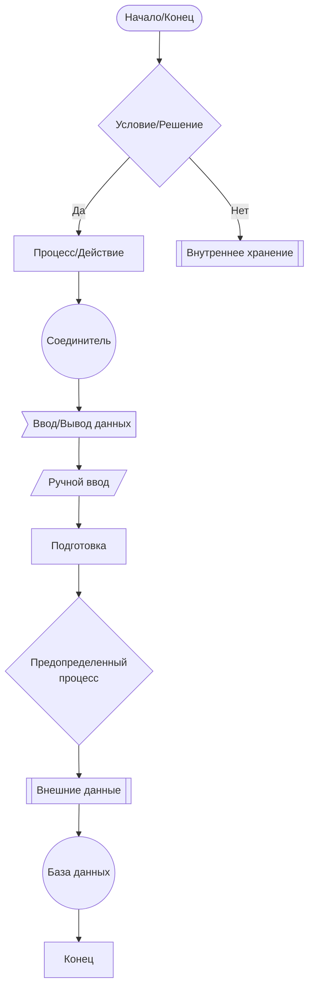
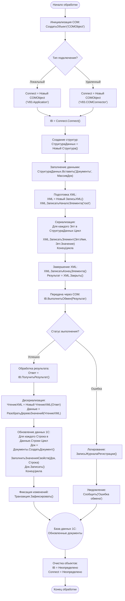
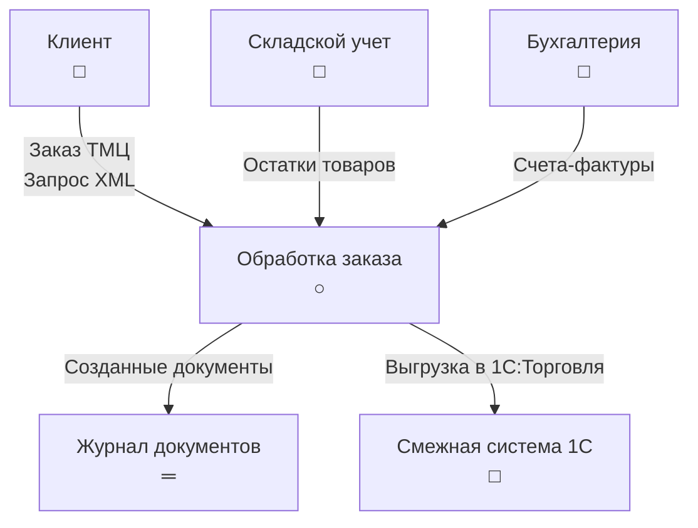
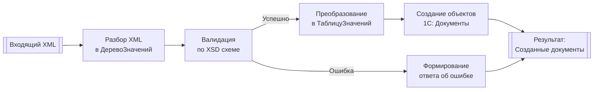

# Детальное объяснение Data Flow Diagrams (DFD) и блок-схем для 1С

## 1. Data Flow Diagrams (DFD) - Блоки и элементы

### Основные объекты DFD:
```
1. Внешние сущности (External Entity)
2. Процессы (Process)
3. Хранилища данных (Data Store)
4. Потоки данных (Data Flow)
```

### Уровни DFD:
- **Контекстная диаграмма (Уровень 0)** - один главный процесс
- **Декомпозиция (Уровни 1, 2, ...)** - детализация процессов

## 2. Блок-схемы в Mermaid: Полный набор фигур

### Основные фигуры:



### Описание всех фигур:
1. `[" "]` - Начало/Конец (скругленный прямоугольник)
2. `{ }` - Условие/Решение (ромб)
3. `[ ]` - Процесс (прямоугольник)
4. `[[ ]]` - Внутреннее хранение (прямоугольник с двойными стенками)
5. `(( ))` - Соединитель (круг)
6. `> ]` - Ввод/Вывод данных (параллелограмм)
7. `/ /` - Ручной ввод/операция (трапеция)
8. `" "` - Подготовка (шестиугольник)
9. `{" "}` - Предопределенный процесс (прямоугольник с вертикальными линиями)
10. `[[" "]]` - Внешние данные (прямоугольник с волнистыми сторонами)
11. `((" "))` - База данных (цилиндр)

## 3. Пример: Обмен данными в 1С через внутренние структуры

```mermaid
flowchart TD
    subgraph DFD_Level0 ["DFD Уровень 0: Контекст"]
        direction LR
        Клиент["Клиент<br>(Внешняя сущность)"] -- "Запрос на обмен<br>XML/JSON" --> Система1C["1C:Предприятие<br>(Главный процесс)"]
        Система1C -- "Выгрузка данных<br>в формате COM" --> ВнешняяСистема["Внешняя CRM<br>(Внешняя сущность)"]
    end
    
    subgraph DFD_Level1 ["DFD Уровень 1: Декомпозиция 1С"]
        A(["Начало обмена"]) --> B{Тип обмена?}
        
        B -->|Внутренний| C[Подготовить<br>структуры данных]
        B -->|Внешний| D[Сформировать<br>внешний формат]
        
        C --> E["Создать объект<br>Соответствие()"]
        E --> F["Заполнить<br>ТаблицуЗначений"]
        F --> G[Преобразовать в<br>ДеревоЗначений]
        
        D --> H["Создать<br>XML/JSON"]
        H --> I["Записать данные<br>в COMObject"]
        
        G --> J{Валидация<br>успешна?}
        I --> J
        
        J -->|Да| K["Выполнить обмен<br>через COM"]
        J -->|Нет| L["Записать ошибку<br>в журнал"]
        
        K --> M(("Хранилище 1С:<br>Регистры, документы"))
        L --> N["Вернуть результат<br>обмена"]
        
        M --> O[/"Завершить<br>обработку"/]
        N --> O
    end
    
    subgraph Процессы ["Детализация процессов 1С"]
        direction TB
        
        P1["Структура данных<br>в 1С"] --> P2[Преобразование<br>в XMLWrite]
        P2 --> P3["Объект XDTO<br>(внутренний)"]
        P3 --> P4[Сериализация<br>в строку]
        P4 --> P5["Передача через<br>COM-соединение"]
        
        P6["Получение данных<br>из внешней системы"] --> P7[Десериализация<br>XDTO]
        P7 --> P8[Запись в<br>ТаблицуЗначений]
        P8 --> P9[Обновление<br>объектов 1С]
    end
    
    subgraph Структуры ["Внутренние структуры 1С"]
        С1["Соответствие()<br>Ключ-Значение"] --- С2["Массив()<br>Индексированный список"]
        С2 --- С3["Структура()<br>Именованные значения"]
        С3 --- С4["ТаблицаЗначений<br>Табличные данные"]
        С4 --- С5["ДеревоЗначений<br>Иерархические данные"]
        С5 --- С6["XMLWrite/XSLTransform<br>Для сериализации"]
    end
```



## 4. Подробный пример обмена через COM в 1С



## 5. Ключевые элементы DFD для 1С в Mermaid

### Контекстная диаграмма:


### Процессы преобразования данных:


## 6. Правила построения DFD для 1С систем:

1. **Именование процессов**: Использовать глаголы ("Обработать", "Создать", "Валидировать")
2. **Уровни детализации**: Каждый процесс уровня N можно детализировать на уровне N+1
3. **Балансировка**: Входы/выходы на верхнем уровне должны соответствовать входам/выходам на нижнем
4. **Хранилища данных**: Показывать только при необходимости сохранения между процессами
5. **Нумерация процессов**: 1.0, 1.1, 1.2, 2.0 и т.д.

## 7. Практические рекомендации:

1. Для сложных обменов использовать комбинацию DFD и блок-схем
2. Выделять критические точки (валидация, трансформация данных)
3. Показывать обработку ошибок на каждом уровне
4. Документировать форматы внутренних структур (Соответствие, ТаблицаЗначений)
5. Указывать типы данных при передаче через COM/XDTO

Этот подход позволяет комплексно описывать архитектуру обмена данными в 1С, начиная от высокоуровневых потоков данных до детальных алгоритмов работы с внутренними структурами.