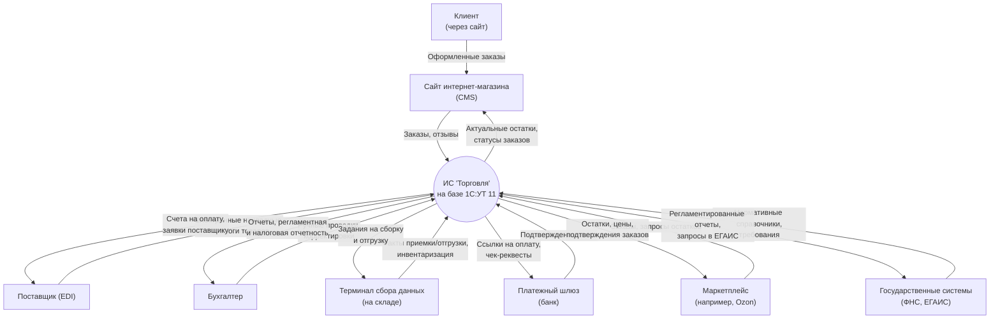
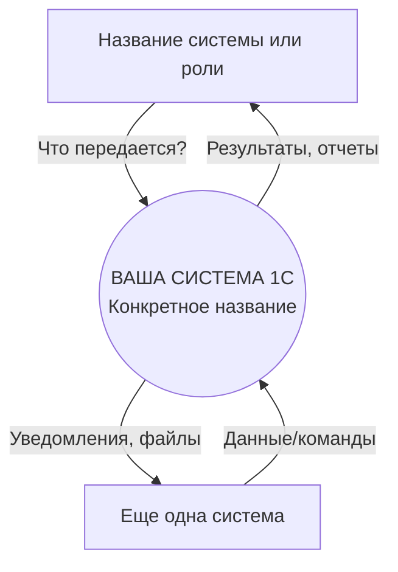

---

### **Модуль 3. Моделирование и описание бизнес-процессов в проектах 1С**

Этот модуль посвящен **переводу** бизнес-потребностей из слов пользователей в формальные, понятные для аналитиков, архитекторов и разработчиков модели. Это "мостик" между миром бизнеса и миром ИТ.

---

### **Часть 1: Моделирование и описание бизнес-процессов (Business Process Modeling)**

Цель — выявить, задокументировать, проанализировать и оптимизировать цепочки действий, которые создают ценность для бизнеса.

**1. Зачем это нужно в проекте 1С?**
*   **Понимание «как есть» (AS-IS):** Объективная картина текущих процессов, а не субъективное мнение. Выявление узких мест, лишних шагов, ручных операций.
*   **Проектирование «как будет» (TO-BE):** Создание идеального целевого процесса, который будет автоматизирован в 1С. Основа для постановки задач разработчикам.
*   **Снижение рисков:** Выявление всех исключений, условий и ролей на этапе проектирования, а не в процессе разработки.
*   **Оценка трудозатрат:** Чем детальнее описан процесс, тем точнее оценка.

**2. Основные нотации (языки моделирования):**

*   **BPMN 2.0 (Business Process Model and Notation) — стандарт де-факто:**
    *   **Потоки действий (Activity):** Что делается (например, "Создать заказ", "Согласовать с руководством").
    *   **События (Event):** Что происходит (например, "Поступил запрос от клиента", "Заказ подтвержден").
    *   **Шлюзы (Gateway):** Логические развилки (например, "Сумма заказа > 100 000?", "Товар в наличии?").
    *   **Потоки управления (Sequence Flow):** Порядок выполнения.
    *   **Потоки данных (Data Flow):** Какие объекты передаются (например, "Документ Заказ", "Файл счета").
    *   **Дорожки (Swimlanes):** Кто отвечает (роль, отдел, система). Например, "Менеджер", "Бухгалтерия", "Система 1С".
    *   **Преимущество:** Визуальная понятность, богатый набор элементов, возможность имитационного моделирования и даже генерации кода (в продвинутых инструментах).

*   **EPC (Event-Driven Process Chain):**
    *   Часто используется в связке с методологией ARIS. Основные элементы: События, Функции, Логические операторы.
    *   Популярен в среде SAP и некоторых крупных предприятиях, но менее гибок и нагляден, чем BPMN.

**3. Практические шаги для проекта 1С:**

*   **Шаг 1: Интервью и сбор информации.** Работа с будущими пользователями системы (менеджерами, кладовщиками, бухгалтерами).
*   **Шаг 2: Создание модели AS-IS в BPMN.** Фиксируем текущий процесс, даже если он бумажный или полуавтоматический. Важно показать все "костыли".
*   **Шаг 3: Анализ и поиск оптимизаций.** Вместе с бизнесом отвечаем на вопросы: Какие шаги можно убрать? Какие автоматизировать? Где возникают ошибки?
*   **Шаг 4: Создание модели TO-BE в BPMN.** Проектируем будущий процесс с учетом автоматизации в 1С. **Здесь уже четко видно, какие действия будут выполнять пользователи в системе 1С, а какие — сама система.**
*   **Шаг 5: Верификация с пользователями.** Убеждаемся, что новая модель понятна и устраивает бизнес.

**Пример для 1С (фрагмент процесса "Обработка заказа клиента"):**
*   **Дорожка "Менеджер":** Событие "Поступил заказ по email" → Действие "Создать документ 'Заказ покупателя' в 1С" → Шлюз "Требуется предоплата?".
*   **Дорожка "Система 1С":** Действие "Провести расчет резерва" → Шлюз "Товар в наличии?".
*   **Дорожка "Склад":** Событие "Поступило задание на отгрузку" → Действие "Создать документ 'Реализация' в 1С".

**Инструменты:** Bizagi Modeler, draw.io (бесплатно), Microsoft Visio, Camunda Modeler, ELMA BPM.

---

### **Часть 2: Моделирование и прототипы интерфейсов (UI/UX Prototyping)**

Цель — наглядно показать, как будет выглядеть и работать интерфейс 1С **до начала программирования**. Это защита от недопонимания и дорогих правок на поздних этапах.

**1. Виды прототипов:**

*   **Эскизы (Sketches / Wireframes):** Быстрые, схематичные, рукописные или простые компьютерные чертежи. Показывают расстановку элементов на форме без дизайна. Используются на ранних этапах обсуждения.
*   **Интерактивные прототипы (Interactive Prototypes):** Макеты, созданные в специальных инструментах (Figma, Axure RP), которые имитируют поведение: можно "нажать" на кнопку и увидеть переход на другую форму или результат действия. **Наиболее эффективны для 1С**, так как позволяют "прочувствовать" будущий процесс.
*   **Прототипы в самой 1С:** Создание черновых форм в тестовой базе с минимальной логикой. Дает 100% понимание, но требует времени разработчика.

**2. Что именно прототипировать в 1С?**

*   **Сложные формы ввода данных:** Например, форма заказа с динамическим подбором товаров.
*   **Новые отчеты и аналитические панели (Дашборды):** Расположение, фильтров, кнопок.
*   **Последовательность диалоговых окон** для сложного бизнес-процесса (например, пошаговый мастер проведения инвентаризации).
*   **Мобильный интерфейс** или веб-клиент, если они используются.

**3. Процесс работы над прототипом:**

1.  На основе модели процесса **TO-BE** определяются точки взаимодействия пользователя с системой (экраны).
2.  Аналитик или дизайнер создает вайрфрейм, согласует его с бизнес-заказчиком на предмет логики и полноты.
3.  Создается интерактивный прототип и передается на "обкатку" ключевым пользователям.
4.  Собранная обратная связь вносится в прототип. **Только после финального согласования прототип становится частью ТЗ** и передается разработчикам.

**Важно для 1С:** Прототип должен учитывать **ограничения и стандартные паттерны платформы 1С**. Нельзя спроектировать интерфейс как для веб-сайта, игнорируя, например, систему команд и панели формы 1С.

**Инструменты:** Figma (лидер), Axure RP (для сложной логики), Adobe XD, Miro (для эскизов).

---

### **Часть 3: Построение архитектурных схем**

Цель — описать высокоуровневое устройство системы, ее ключевые компоненты, взаимодействие с внешним миром и внутренние связи. Это "вид с высоты птичьего полета" для архитектора и команды.

**1. Контекстная диаграмма (Context Diagram):**
*   **Что показывает:** Систему 1С как **единый черный ящик** и все внешние сущности, которые с ней взаимодействуют.
*   **Для чего:** Определить границы проекта и все интерфейсы взаимодействия.
*   **Элементы:** Один блок (наша система 1С) и множество стрелок от/к внешним системам (Банк-клиент, CRM, Сайт, WMS, Кассовый аппарат, Гос. системы (ФНС, ФСС), Сканер штрихкодов).
*   **Артефакт на выходе:** Список всех необходимых интеграций для оценки.

**2. Диаграмма компонентов (Component Diagram):**
*   **Что показывает:** Крупные логические блоки (компоненты) внутри системы 1С и связи между ними.
*   **Для чего:** Пономнить, как устроена система изнутри, разделить ответственность.
*   **Элементы:** Компоненты (например, "Подсистема закупок", "Подсистема расчетов с персоналом", "Подсистема бухгалтерского учета", "Общий модуль интеграции"), интерфейсы между ними.
*   **Особенность для 1С:** Часто компоненты соответствуют **подсистемам** в конфигураторе 1С.

**3. Схема интеграций (Integration Diagram / Data Flow Diagram):**
*   **Что показывает:** Детальный процесс обмена данными между 1С и каждой внешней системой.
*   **Для чего:** Для проектирования интеграций.
*   **Элементы:** Протокол обмена (HTTP/SOAP/REST/файлы), форматы данных (XML/JSON), направление, частота, объемы.
*   **Пример:** "1С → (выгружает XML файл по FTP каждые 15 мин) → CMS сайта".

**4. Схема данных (Data Model / ER-диаграмма):**
*   **Что показывает:** Логическую структуру базы данных: ключевые сущности (документы, справочники) и связи между ними.
*   **Для чего:** Основа для разработки структуры метаданных в 1С, проектирования регистров и отчетов.
*   **Нотации:** IDEF1X, "воронья лапка" (Crow's Foot). Можно строить на уровне классов или прямо на уровне таблиц СУБД.
*   **Пример для 1С:** Сущность "Контрагент" связана с сущностью "Договор", которая связана с сущностью "Документ Заказ".

**5. Диаграмма развертывания (Deployment Diagram):**
*   **Что показывает:** Физическую инфраструктуру: серверы, рабочие станции, сетевые устройства и размещение на них программных компонентов.
*   **Для чего:** Для системных администраторов и архитекторов. Планирование нагрузки, отказоустойчивости.
*   **Элементы:** Сервер БД (SQL/PostgreSQL), сервер кластера 1С, веб-сервер (для веб-клиента), файловый сервер (для обменов), рабочие места пользователей.

**Инструменты:** draw.io / diagrams.net (универсально и бесплатно), Microsoft Visio, Lucidchart, Sparx Enterprise Architect (для сложных моделей), PlantUML (текстовое описание для генерации схем).

### **Итог по модулю:**

Три этих слоя моделирования образуют **полный цикл проектирования**:
1.  **BPMN (Процессы)** отвечает на вопрос **"ЧТО делают люди и система?"**.
2.  **Прототипы (Интерфейсы)** отвечают на вопрос **"КАК пользователь будет это делать и что увидит на экране?"**.
3.  **Архитектурные схемы** отвечают на вопрос **"ИЗ ЧЕГО состоит система и КАК ее части связаны между собой и с внешним миром?"**.

Этот подход позволяет:
*   **Сократить риски** недопонимания между бизнесом и ИТ.
*   **Обеспечить предсказуемость** результата.
*   **Создать качественную документацию**, которая живет дольше, чем конкретная версия кода, и служит основой для будущих изменений.
*   **Эффективно коммуницировать** внутри команды (архитектору с разработчиком, аналитику с тестировщиком).

---

### **Практическое руководство: Создание Контекстной Диаграммы для проекта 1С**

Контекстная диаграмма — это диаграмма **потока данных (DFD) уровня 0**. Она должна быть понятна и бизнес-заказчику, и техническому специалисту.

#### **Шаг 1: Определите центральную систему**
*   Назовите вашу систему 1С. Будьте конкретны.
*   **Плохо:** «1С»
*   **Хорошо:** «1С:ERP Управление предприятием 2.5»
*   **Еще лучше:** «ИС «Учет и продажи» (на базе 1С:УТ 11)»

#### **Шаг 2: Выявите всех внешних «акторов» (External Entities)**
Это люди, организации, системы или устройства, которые **обмениваются данными** с вашей 1С. Задайте вопросы:
*   Кто предоставляет данные для системы? (Поставщики данных)
*   Кто получает данные из системы? (Потребители данных)
*   С какими другими ИТ-системами она должна работать?

#### **Шаг 3: Определите потоки данных (Data Flows)**
Для каждой связи спросите: **«Что именно передается?»**. Используйте существительные.
*   **Плохо:** «Связь с сайтом»
*   **Хорошо:** «Заказы клиентов», «Остатки товаров», «Обновленные ценники»

#### **Шаг 4: Определите направление**
Стрелка показывает **направление потока данных**, а не управления. От кого исходят данные → кому они предназначены.

---

### **Синтаксис Mermaid для Контекстной Диаграммы**

Mermaid использует синтаксис `flowchart TD` (Top-Down) для таких схем. Ключевые элементы:

*   **Внешняя сущность (External Entity):** `id["Название"]` (квадратные скобки)
*   **Система (Process):** `id[["Название"]]` (двойные квадратные скобки) *или просто* `id(("Название"))` (круг)
*   **Поток данных (Arrow):** `Источник --> |"что передается"| Приемник`

#### **Пример 1: Базовая схема для интернет-магазина**

Давайте создадим диаграмму для системы «1С:Управление торговлей 11», которая обслуживает интернет-магазин.

---

### **Как использовать эту диаграмму на практике (Артефакт на выходе)**

Диаграмма — это наглядная часть. Она должна сопровождаться **табличной спецификацией**, которая станет основой для технического дизайна.

#### **Спецификация интерфейсов (на основе диаграммы)**

| **№** | **Внешняя система/актор** | **Направление** | **Что передается (данные)** | **Предполагаемый способ/технология** | **Частота/триггер** | **Приоритет** | **Комментарий** |
| :--- | :--- | :--- | :--- | :--- | :--- | :--- | :--- |
| **1.** | **Сайт (CMS)** | К 1С | Заказы клиентов, данные сессий | REST API (JSON) | По событию (оформление заказа) | Высокий | Основной канал продаж |
| | | От 1С | Остатки, цены, статусы заказов | REST API (JSON) | По событию + по расписанию (раз в 5 мин) | Высокий | Кэширование на стороне сайта |
| **2.** | **Маркетплейс (Ozon)** | К 1С | Заказы, запросы цен/остатков | Стандартное API Ozon (JSON) | По расписанию (раз в 30 мин) | Средний | Нужна регистрация в личном кабинете Ozon |
| | | От 1С | Подтверждение заказов, остатки, цены | Стандартное API Ozon (JSON) | По расписанию (раз в час) | Средний | Автоматическая выгрузка остатков |
| **3.** | **Платежный шлюз** | К 1С | Уведомления об успешных оплатах | HTTP-callback (webhook) | По событию | Высокий | Проверка цифровой подписи |
| | | От 1С | Ссылки для оплаты, суммы | Встраивание в форму сайта | По событию | Высокий | Через JS виджет банка |
| **4.** | **ТСД (Терминал)** | К 1С | Факты отгрузки, сканы штрихкодов | Тонкий клиент 1С / HTTP-сервисы | По событию (сканирование) | Высокий | Работа в режиме офлайн-доступности |
| **5.** | **Гос. системы (ФНС)** | От 1С | Налоговая отчетность (НДС, Прибыль) | Выгрузка в XML + загрузка через сайт ФНС | По регламенту (месяц/квартал) | Высокий | Использование конфигурации «1С-Отчетность» |

---

### **Шаблон Mermaid для вашего проекта**

Скопируйте этот код, отредактируйте и вставьте в любой инструмент, поддерживающий Mermaid (GitLab/GitHub Markdown, Notion, Obsidian, отдельный редактор на [mermaid.live](https://mermaid.live)).

### **Ключевые выводы и правила:**

1.  **Один уровень детализации:** Не показывайте внутреннее устройство 1С (подсистемы, модули). Это следующий уровень — диаграмма компонентов.
2.  **Фокус на данные:** Стрелка — это не «отправляет команду», а «передает *заказы*» или «получает *отчеты*».
3.  **Исчерпывающий охват:** Диаграмма должна включать **ВСЕ** запланированные интеграции. Пропущенная здесь интеграция = риск срыва сроков и бюджета позже.
4.  **Живой документ:** Схема должна обновляться при появлении новых требований к интеграции.
5.  **Точка входа для оценок:** Разработчик или архитектор, глядя на эту схему и таблицу, может дать первую реалистичную оценку трудозатрат на интеграции.

Таким образом, контекстная диаграмма — это **стратегический артефакт**, который синхронизирует ожидания бизнеса и технических специалистов с самого начала проекта. Ее создание — первый шаг к успешному проектированию архитектуры.