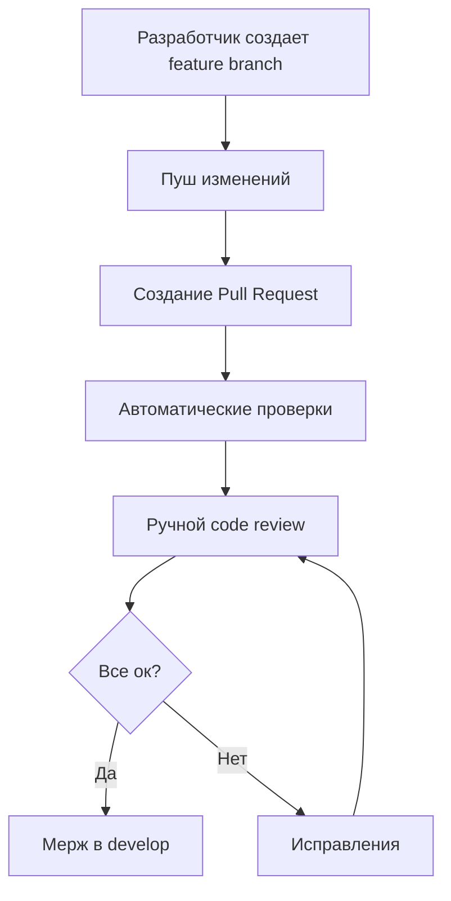

# Модуль 4: Автоматизация работы разработчиков и контроль качества кода в 1С разработке

## 📋 Введение
Современная 1С-разработка перестала быть исключительно локальной деятельностью в конфигураторе. Сегодня это полноценная инженерная дисциплина, требующая автоматизации, контроля версий и поддержания качества кода на профессиональном уровне.

---

## 1. Вспомогательные средства разработки

### **Git - система контроля версий**

**Что это и зачем нужно:**
- Система отслеживания изменений в исходном коде
- Позволяет работать команде над одним проектом без конфликтов
- Сохраняет историю всех изменений с возможностью отката

**Проблемы 1С с Git и их решение:**
```plaintext
Проблема: Исходники 1С в формате XML очень объемные
Решение: Использование формата .md для конфигураций

Проблема: Конфликты при слиянии изменений
Решение: Четкая стратегия ветвления (git-flow)

Проблема: Бинарные файлы (картинки, макеты)
Решение: Git LFS (Large File Storage)
```

**Типичный workflow для 1С:**
```
main (основная ветка) 
    ↑
develop (разработка)
    ↑
feature/новая-функция (функциональность)
    ↑
hotfix/срочное-исправление (исправления в production)
```

### **OneScript - скриптовый язык для автоматизации**

**Назначение:**
- Автоматизация рутинных задач в экосистеме 1С
- Аналог Python/Bash для 1С-разработчиков

**Основные возможности:**
```javascript
// Пример: Автоматическое создание тестовой базы
База = ЗапуститьИПодключитьБазу("путь/к/шаблону.dt");
ВыполнитьЗапрос(База, "ВЫБРАТЬ * ИЗ Справочник.Контрагенты");

// Автоматизация выгрузки конфигурации
Конфигуратор = Новый Конфигуратор1С();
Конфигуратор.ВыгрузитьКонфигурациюВФайлы("путь/к/выгрузке");
```

**Типичные сценарии использования:**
- **Миграции данных** между базами
- **Пакетное обновление** конфигураций
- **Автотестирование** через Vanessa
- **Интеграция** с CI/CD системами
- **Генерация документации** из кода

---

## 2. **EDT (Eclipse-based Development Tools)**

### **Преимущества перед конфигуратором:**

| Функция | Конфигуратор | EDT |
|---------|--------------|-----|
| **Рефакторинг** | Ограниченный | Полноценный (переименование, извлечение метода) |
| **Поиск кода** | Базовый | Продвинутый (по всему проекту, с контекстом) |
| **Навигация** | Простая | Быстрая (Go to definition, Find usages) |
| **Отладка** | Есть | Более удобная |
| **Работа с Git** | Нет | Интегрирована |

### **Ключевые возможности EDT:**

**1. Проектный подход:**
```
ВашПроект/
├── src/                    # Исходный код
├── lib/                    # Внешние библиотеки
├── tests/                  # Тесты
└── .gitignore             # Исключения для Git
```

**2. Интеллектуальный редактор:**
- Автодополнение кода
- Проверка синтаксиса на лету
- Подсказки по параметрам методов
- Быстрые исправления (quick fixes)

**3. Инструменты анализа:**
```java
// EDT показывает проблемы до компиляции
Если Истина Тогда  // Предупреждение: всегда истинное условие
    // ...
КонецЕсли;
```

**4. Интеграция с системами сборки:**
- Gradle для автоматизации сборки
- Maven для управления зависимостями
- Поддержка CI/CD пайплайнов

---

## 3. **Управление качеством кода 1С (SonarQube)**

### **Архитектура решения:**

```
[1С код] → [Выгрузка в файлы] → [Анализ SonarQube] → [Отчеты/Dashboard]
        ↓
   [EDT Plugin] → [Локальная проверка]
```

### **Что анализирует SonarQube:**

**1. Технический долг:**
```plaintext
- Сложные методы (более 20 строк)
- Высокая цикломатическая сложность
- Дублирование кода
- Нарушения стандартов кодирования
```

**2. Безопасность:**
```1c
// Проблема: SQL-инъекция
Запрос = Новый Запрос("ВЫБРАТЬ * ИЗ Справочник.Контрагенты 
                       ГДЕ Наименование = '" + Имя + "'");

// Решение: Параметризованные запросы
Запрос = Новый Запрос("ВЫБРАТЬ * ИЗ Справочник.Контрагенты 
                       ГДЕ Наименование = &Имя");
Запрос.УстановитьПараметр("Имя", Имя);
```

**3. Надежность:**
```1c
// Проблема: Возможное деление на ноль
Результат = Числитель / Знаменатель;  // SonarQube предупредит

// Решение: Проверка перед делением
Если Знаменатель <> 0 Тогда
    Результат = Числитель / Знаменатель;
Иначе
    Результат = 0;
КонецЕсли;
```

**4. Поддержка стандартов:**
- Соблюдение "Стандартов разработки 1С"
- Проверка именования переменных, методов, модулей
- Контроль сложности выражений

### **Процесс интеграции:**
1. **Установка** SonarQube Scanner для 1С
2. **Настройка** правил проверки под ваш проект
3. **Интеграция** в процесс CI/CD
4. **Настройка** quality gates (проходные критерии)
5. **Мониторинг** метрик через дашборд

---

## 4. **Code Review + git-flow для 1С**

### **Процесс code review в команде:**



### **Что проверять при code review:**

**1. Архитектурные проблемы:**
```1c
// ❌ Плохо: Жесткая связность
Процедура ОбработатьЗаказ(Заказ)
    // 100 строк бизнес-логики
    // Обработка печати
    // Работа с БД
    // Отправка email
КонецПроцедуры

// ✅ Хорошо: Разделение ответственности
Процедура ОбработатьЗаказ(Заказ)
    ВалидацияЗаказа(Заказ);
    СохранитьЗаказ(Заказ);
    ОтправитьУведомление(Заказ);
КонецПроцедуры
```

**2. Качество кода:**
```1c
// ❌ Магические числа
Если Статус = 5 Тогда  // Что такое 5?
    // ...
КонецЕсли;

// ✅ Константы
#Если Сервер Тогда
    СтатусЗавершен = 5;
#КонецЕсли

Если Статус = СтатусЗавершен Тогда
    // ...
КонецЕсли;
```

**3. Производительность:**
```1c
// ❌ N+1 проблема в циклах
Для Каждого Заказ Из Заказы Цикл
    Контрагент = Справочники.Контрагенты.НайтиПоНаименованию(Заказ.Контрагент);
    // Запрос на каждый заказ!
КонецЦикла;

// ✅ Оптимизация запросов
Запрос = Новый Запрос;
Запрос.Текст = "
    |ВЫБРАТЬ
    |    Заказы.Ссылка,
    |    Контрагенты.Наименование КАК Контрагент
    |ИЗ
    |    Документ.Заказы КАК Заказы
    |        ЛЕВОЕ СОЕДИНЕНИЕ Справочник.Контрагенты КАК Контрагенты
    |        ПО Заказы.Контрагент = Контрагенты.Ссылка";
```

### **Git-flow адаптированный для 1С:**

**Ветки:**
- `main` - только стабильные релизы
- `develop` - текущая разработка
- `feature/*` - новые функции
- `release/*` - подготовка к выпуску
- `hotfix/*` - срочные исправления

**Типичный релизный цикл:**
```
1. feature/новый-отчет → develop     # Разработка
2. develop → release/2.1.0           # Подготовка релиза
3. release/2.1.0 → main              # Выпуск
4. main → develop                    Синхронизация
5. hotfix/баг-в-производстве → main  Срочное исправление
```

### **Инструменты для code review:**

1. **GitLab/GitHub** - встроенные системы
2. **Upr** - специализированный инструмент для 1С
3. **Jira + Crucible** - для корпоративных решений
4. **Telegram/Slack боты** - уведомления о PR

---

## 🚀 Практическая реализация в проекте

### **DevOps pipeline для 1С:**

```yaml
# .gitlab-ci.yml пример
stages:
  - build
  - test
  - analyze
  - deploy

build:
  stage: build
  script:
    - oscript build.os  # Сборка через OneScript
    
test:
  stage: test
  script:
    - oscript run_tests.os  # Запуск автотестов
    
sonarqube-check:
  stage: analyze
  script:
    - sonar-scanner  # Анализ качества кода
    
deploy-to-test:
  stage: deploy
  script:
    - oscript deploy.os --env test  # Развертывание на тест
```

### **Чеклист внедрения:**

1. [ ] Настроить Git репозиторий
2. [ ] Внедрить EDT у всех разработчиков
3. [ ] Настроить правила code style
4. [ ] Развернуть SonarQube
5. [ ] Определить процесс code review
6. [ ] Автоматизировать сборку и тестирование
7. [ ] Настроить CI/CD pipeline
8. [ ] Обучить команду новым практикам

---

## 📊 Ключевые метрики качества

| Метрика | Целевое значение | Инструмент измерения |
|---------|------------------|---------------------|
| **Покрытие тестами** | >70% | SonarQube |
| **Технический долг** | <5% от времени разработки | SonarQube |
| **Время code review** | <2 дня на PR | GitLab/GitHub |
| **Количество багов в production** | <1 на 1000 строк кода | Jira + Git |

---

## 💡 Выгоды от внедрения

**Для бизнеса:**
- Сокращение времени выхода на рынок
- Уменьшение количества багов в production
- Более предсказуемые сроки разработки

**Для разработчиков:**
- Меньше рутинной работы
- Автоматизация повторяющихся задач
- Единые стандарты кодирования
- Прозрачный процесс разработки

**Для проекта:**
- Поддерживаемость кода
- Возможность масштабирования команды
- Качественная документация через самоописание кода

---

## 🔚 Заключение

Автоматизация разработки 1С — это не роскошь, а необходимость для современных проектов. Комбинация Git, EDT, SonarQube и правильного процесса code review позволяет:

1. **Увеличить скорость** разработки в 2-3 раза
2. **Снизить количество** ошибок на 40-60%
3. **Упростить** онбординг новых разработчиков
4. **Повысить** предсказуемость релизов
5. **Создать** культуру качества в команде

**Главный принцип:** Автоматизируйте всё, что можно автоматизировать, чтобы разработчики могли сосредоточиться на создании бизнес-ценности, а не на рутинных операциях.