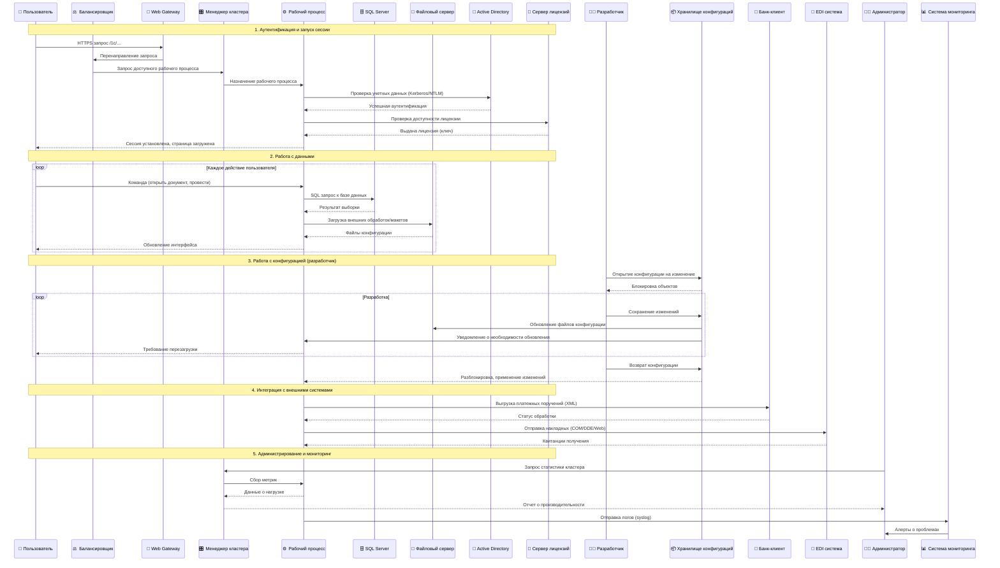
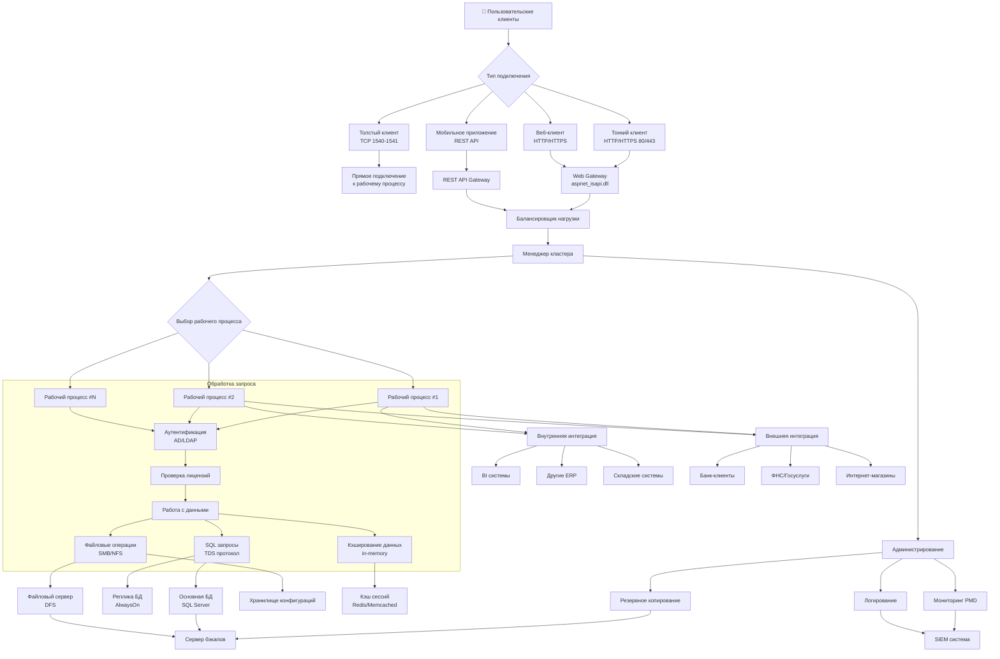

# **Диаграмма: Архитектура 1С Предприятие в корпоративной среде**

```mermaid
flowchart TD
    subgraph "👥 Пользовательский уровень"
        direction LR
        PC_WIN[Толстый клиент Windows<br>1С:Предприятие 8]
        PC_WEB[Тонкий клиент<br>Веб-браузер]
        PC_RDP[Терминальный доступ<br>RDP/RemoteApp]
        MOBILE[Мобильное приложение<br>1С:Мобильная платформа]
        
        PC_WIN & PC_WEB & PC_RDP & MOBILE --> LOAD_BALANCER_1C
    end

    subgraph "⚖️ Уровень балансировки и доступа"
        LOAD_BALANCER_1C[Балансировщик нагрузки 1С<br>nginx/HAProxy/F5]
        GATEWAY[Шлюз 1С<br>Web Gateway]
        SEC_GW[Безопасный шлюз<br>HTTPS/TLS termination]
        
        LOAD_BALANCER_1C --> CLUSTER_MANAGER
        GATEWAY --> LOAD_BALANCER_1C
        SEC_GW --> GATEWAY
    end

    subgraph "🖥️ Уровень кластера серверов 1С"
        CLUSTER_MANAGER[Менеджер кластера<br>Central Server]
        
        subgraph "Кластер рабочих процессов"
            WP1[Рабочий процесс 1<br>rmngr.exe]
            WP2[Рабочий процесс 2]
            WP3[Рабочий процесс 3]
            WP4[Рабочий процесс 4]
        end
        
        CLUSTER_MANAGER --> WP1 & WP2 & WP3 & WP4
    end

    subgraph "💾 Уровень данных и СУБД"
        direction LR
        
        subgraph "Основная база данных"
            SQL_PRI[(SQL Server Primary<br>AlwaysOn Availability Group)]
        end
        
        subgraph "Реплика базы данных"
            SQL_SEC[(SQL Server Secondary<br>Синхронная реплика)]
        end
        
        subgraph "Резервная реплика"
            SQL_DR[(SQL Server DR Site<br>Асинхронная реплика)]
        end
        
        WP1 & WP2 & WP3 & WP4 --> SQL_PRI
        SQL_PRI -- AlwaysOn Sync --> SQL_SEC
        SQL_PRI -- Log Shipping --> SQL_DR
    end

    subgraph "📁 Уровень файлового хранилища"
        FS_1C[Файловый сервер 1С<br>Конфигурации, общие макеты]
        DFS_NAMESPACE[DFS Namespace<br>\\corp\1C_Shared]
        VERSION_STORE[Хранилище конфигураций<br>1C:Хранилище]
        
        WP1 & WP2 & WP3 & WP4 --> FS_1C
        FS_1C --> DFS_NAMESPACE
        DEV_TOOLS --> VERSION_STORE
    end

    subgraph "🛠️ Уровень разработки и администрирования"
        DEV_SERVER[Сервер разработки<br>1С:Конфигуратор]
        ADMIN_TOOLS[Административные консоли<br>1С:Администратор сервера]
        MONITOR_1C[Мониторинг 1С<br>ПМД, 1С:Аналитика]
        DEV_TOOLS[Инструменты разработки<br>GIT, Сравнение конфигураций]
        
        DEV_SERVER --> VERSION_STORE
        ADMIN_TOOLS --> CLUSTER_MANAGER
        MONITOR_1C --> WP1 & WP2 & SQL_PRI
    end

    subgraph "🔗 Интеграционный уровень"
        subgraph "Внутренняя интеграция"
            INT_ERP[Другие ERP системы]
            INT_BI[BI системы<br>Power BI, 1С:Аналитика]
            INT_EDI[EDI обмен<br>Контур, Такском]
        end
        
        subgraph "Внешняя интеграция"
            EXT_BANK[Банк-клиенты<br>ДБО]
            EXT_FNS[ФНС/Государственные системы]
            EXT_ECOM[Интернет-магазины<br>CMS системы]
        end
        
        WP1 & WP2 --> INT_ERP & INT_BI & INT_EDI
        WP1 & WP2 --> EXT_BANK & EXT_FNS & EXT_ECOM
    end

    subgraph "🛡️ Уровень инфраструктуры и безопасности"
        AD[Active Directory<br>Аутентификация пользователей]
        BACKUP_1C[Система бэкапа 1С<br>Veeam/SQL Backup]
        SIEM_1C[SIEM/Мониторинг<br>Логи 1С]
        LICENSE[Сервер лицензий<br>1С:Центр лицензий]
        
        CLUSTER_MANAGER --> AD
        SQL_PRI & FS_1C --> BACKUP_1C
        CLUSTER_MANAGER & SQL_PRI --> SIEM_1C
        WP1 & WP2 --> LICENSE
    end

    %% Стилизация компонентов
    style PC_WIN fill:#e3f2fd
    style PC_WEB fill:#e3f2fd
    style PC_RDP fill:#e3f2fd
    style MOBILE fill:#e3f2fd
    
    style LOAD_BALANCER_1C fill:#bbdefb
    style GATEWAY fill:#bbdefb
    style SEC_GW fill:#bbdefb
    
    style CLUSTER_MANAGER fill:#c8e6c9
    style WP1 fill:#c8e6c9
    style WP2 fill:#c8e6c9
    
    style SQL_PRI fill:#ffecb3
    style SQL_SEC fill:#ffecb3
    
    style FS_1C fill:#f8bbd0
    style VERSION_STORE fill:#f8bbd0
    
    style DEV_SERVER fill:#d1c4e9
    style ADMIN_TOOLS fill:#d1c4e9
    
    style INT_ERP fill:#b2dfdb
    style EXT_BANK fill:#b2dfdb
    
    style AD fill:#ffccbc
    style BACKUP_1C fill:#ffccbc
```

---

# **Детализированная схема взаимодействия компонентов 1С**

---

# **Схема потоков данных в системе 1С**

---

# **Таблица: Протоколы и порты в системе 1С**

| Компонент | Протокол/Порт | Назначение | Направление |
|-----------|--------------|------------|-------------|
| **Толстый клиент** | TCP 1540-1541 | Прямое подключение к рабочему процессу | Клиент → Сервер 1С |
| **Web Gateway** | HTTP/80, HTTPS/443 | Веб-доступ к 1С | Пользователь → IIS/Apache |
| **Рабочий процесс** | TCP 1540-1541 | Внутренняя коммуникация | Менеджер кластера ↔ Рабочие процессы |
| **SQL Server** | TCP 1433 | Доступ к базе данных | Рабочий процесс → SQL Server |
| **Active Directory** | LDAP 389, Kerberos 88 | Аутентификация | Все компоненты → AD |
| **Файловый сервер** | SMB 445, NFS 2049 | Доступ к файлам | Рабочий процесс → Файловый сервер |
| **Лицензионный сервер** | TCP 47500-47509 | Управление лицензиями | Рабочий процесс → Сервер лицензий |
| **Хранилище конфигураций** | TCP 1542 | Разработка и обновление | Конфигуратор → Хранилище |

---

# **Таблица взаимодействия компонентов системы 1С Предприятие**

## **1. УРОВЕНЬ ДОСТУПА ПОЛЬЗОВАТЕЛЕЙ**

| № | Компонент | Тип | Назначение | Куда подключается (Выход) | Откуда принимает (Вход) | Протоколы | Особенности |
|---|-----------|-----|------------|--------------------------|------------------------|-----------|-------------|
| 1.1 | **Толстый клиент Windows** | Desktop приложение | Прямой запуск 1С на рабочей станции | → Балансировщик нагрузки 1С | ← Ответы от рабочего процесса | TCP 1540-1541 | Высокая производительность, требуется установка |
| 1.2 | **Тонкий клиент (Веб)** | Веб-браузер | Доступ через браузер без установки | → Шлюз 1С (Web Gateway) | ← HTML/JS от шлюза | HTTP/HTTPS 80/443 | Кроссплатформенность, минимальные требования |
| 1.3 | **Терминальный доступ** | RDS/RemoteApp | Централизованный доступ для удаленных пользователей | → Сервер терминалов → Балансировщик | ← Графический интерфейс RDP | RDP 3389 | Централизованное управление, безопасность |
| 1.4 | **Мобильное приложение** | Мобильное приложение | Доступ с мобильных устройств | → Безопасный шлюз HTTPS | ← REST API ответы | HTTPS 443 | Ограниченный функционал, оффлайн режим |

## **2. УРОВЕНЬ БАЛАНСИРОВКИ И ДОСТУПА**

| № | Компонент | Тип | Назначение | Куда подключается | Откуда принимает | Протоколы | Особенности |
|---|-----------|-----|------------|-------------------|------------------|-----------|-------------|
| 2.1 | **Безопасный шлюз HTTPS** | Reverse Proxy | TLS termination, защита трафика | → Шлюз 1С (Web Gateway) | ← HTTPS запросы от пользователей | HTTPS 443 | SSL-шифрование, защита от DDoS |
| 2.2 | **Шлюз 1С (Web Gateway)** | ISAPI Extension | Преобразование HTTP в TCP для 1С | → Балансировщик нагрузки | ← Запросы от безопасного шлюза | HTTP → TCP | aspnet_isapi.dll, кэширование |
| 2.3 | **Балансировщик нагрузки** | Load Balancer | Распределение нагрузки между менеджерами кластера | → Менеджер кластера | ← Запросы от всех клиентов | TCP/HTTP | Health checks, сессионная аффинность |

## **3. УРОВЕНЬ КЛАСТЕРА СЕРВЕРОВ 1С**

| № | Компонент | Тип | Назначение | Куда подключается | Откуда принимает | Протоколы | Особенности |
|---|-----------|-----|------------|-------------------|------------------|-----------|-------------|
| 3.1 | **Менеджер кластера** | Центральный сервер | Управление кластером, распределение сессий | → Рабочие процессы → Active Directory → SIEM | ← Запросы от балансировщика ← Команды администрирования | TCP 1540-1541 LDAP 389 Syslog | Координация работы кластера, мониторинг |
| 3.2 | **Рабочий процесс #1-4** | Серверный процесс | Выполнение бизнес-логики, обработка запросов | → SQL Server → Файловый сервер → Сервер лицензий → Интеграционные системы | ← Задания от менеджера кластера | TDS 1433 SMB 445 TCP 47500 | rmngr.exe, изоляция сессий, пул процессов |

## **4. УРОВЕНЬ ДАННЫХ И СУБД**

| № | Компонент | Тип | Назначение | Куда подключается | Откуда принимает | Протоколы | Особенности |
|---|-----------|-----|------------|-------------------|------------------|-----------|-------------|
| 4.1 | **SQL Server Primary** | Основная БД | Хранение данных 1С, обработка транзакций | → Реплика БД (синхронная) → Система бэкапа → SIEM | ← SQL запросы от рабочих процессов | TDS 1433 AlwaysOn | Высокая доступность, автоматическая отработка отказа |
| 4.2 | **SQL Server Secondary** | Реплика БД | Горячий резерв, чтение отчетов | → Резервная реплика | ← Синхронная репликация от Primary | AlwaysOn Sync | Read-only доступ, снижение нагрузки на Primary |
| 4.3 | **SQL Server DR Site** | Аварийная реплика | Восстановление после катастрофы | ← Асинхронная репликация | → (в режиме аварийного восстановления) | Log Shipping | Географическое разнесение, RPO несколько минут |

## **5. УРОВЕНЬ ФАЙЛОВОГО ХРАНИЛИЩА**

| № | Компонент | Тип | Назначение | Куда подключается | Откуда принимает | Протоколы | Особенности |
|---|-----------|-----|------------|-------------------|------------------|-----------|-------------|
| 5.1 | **Файловый сервер 1С** | Файловый сервер | Хранение внешних обработок, макетов, общих файлов | → DFS Namespace | ← Запросы файлов от рабочих процессов | SMB 445 NFS 2049 | Отказоустойчивость, репликация между узлами |
| 5.2 | **DFS Namespace** | Виртуальная файловая система | Единое пространство имен для файловых ресурсов | ← Доступ от пользователей/серверов | → Репликация между файловыми серверами | SMB 445 | Прозрачная отказоустойчивость, балансировка |
| 5.3 | **Хранилище конфигураций** | Система контроля версий | Хранение и управление версиями конфигурации 1С | ← Запросы от сервера разработки | → Уведомления об обновлениях | TCP 1542 | Блокировка объектов, история изменений |

## **6. УРОВЕНЬ РАЗРАБОТКИ И АДМИНИСТРИРОВАНИЯ**

| № | Компонент | Тип | Назначение | Куда подключается | Откуда принимает | Протоколы | Особенности |
|---|-----------|-----|------------|-------------------|------------------|-----------|-------------|
| 6.1 | **Сервер разработки** | Конфигуратор 1С | Разработка и изменение конфигурации | → Хранилище конфигураций | ← Инструменты разработки (GIT) | TCP 1542 SSH 22 | Изолированная среда, тестирование изменений |
| 6.2 | **Административные консоли** | Утилиты администрирования | Управление кластером, мониторинг | → Менеджер кластера | ← Команды администратора | TCP 1540 RDP 3389 | Управление лицензиями, настройка параметров |
| 6.3 | **Мониторинг 1С** | Система мониторинга | Сбор метрик производительности | → Рабочие процессы, SQL Server | ← Данные для анализа | SNMP 161 WMI | Анализ производительности, предупреждения |
| 6.4 | **Инструменты разработки** | Внешние системы | Интеграция с системами разработки | → Хранилище конфигураций | ← Экспорт конфигурации | GIT/SSH | Автоматизация сборки, CI/CD |

## **7. ИНТЕГРАЦИОННЫЙ УРОВЕНЬ**

| № | Компонент | Тип | Назначение | Куда подключается | Откуда принимает | Протоколы | Особенности |
|---|-----------|-----|------------|-------------------|------------------|-----------|-------------|
| 7.1 | **Внутренние ERP системы** | Корпоративные системы | Обмен данными между системами | ← Запросы/данные от 1С | → Ответы/данные в 1С | SOAP/REST ODBC/JDBC | Двусторонняя синхронизация, планировщик |
| 7.2 | **BI системы** | Business Intelligence | Аналитика и отчетность | ← Данные из 1С | → Запросы отчетов | OData SQL | Репликация данных, кубы OLAP |
| 7.3 | **EDI обмен** | Электронный документооборот | Обмен юр. документами с контрагентами | ← Документы из 1С | → Статусы документов | AS2/OFTP REST API | Юридическая значимость, шифрование |
| 7.4 | **Банк-клиенты** | ДБО системы | Отправка платежей, выписки | ← Платежные поручения | → Статусы платежей | HTTPS Web Services | Электронная подпись, протоколы банков |
| 7.5 | **ФНС/Государственные системы** | Государственные порталы | Сдача отчетности, проверки | ← Отчеты из 1С | → Квитанции, требования | ГОСТ 34.10 SOAP | Криптография, юридические требования |
| 7.6 | **Интернет-магазины** | E-commerce платформы | Синхронизация товаров, заказов | ← Заказы, остатки | → Статусы заказов | REST API XML-RPC | Реальное время, инвентаризация |

## **8. УРОВЕНЬ ИНФРАСТРУКТУРЫ И БЕЗОПАСНОСТИ**

| № | Компонент | Тип | Назначение | Куда подключается | Откуда принимает | Протоколы | Особенности |
|---|-----------|-----|------------|-------------------|------------------|-----------|-------------|
| 8.1 | **Active Directory** | Служба каталогов | Централизованная аутентификация | ← Запросы аутентификации от всех компонентов | → Ответы аутентификации | LDAP 389 Kerberos 88 | Единый вход, групповые политики |
| 8.2 | **Система бэкапа 1С** | Резервное копирование | Резервное копирование данных и конфигураций | → SQL Server, Файловый сервер | ← Задания от планировщика | VSS SQL Backup | Транзакционно-согласованные копии |
| 8.3 | **SIEM система** | Безопасность и мониторинг | Сбор и анализ логов безопасности | ← Логи от всех компонентов | → Алерты администраторам | Syslog 514 SNMP Traps | Корреляция событий, compliance |
| 8.4 | **Сервер лицензий** | Лицензирование | Управление лицензиями 1С | ← Запросы лицензий от рабочих процессов | → Выдача лицензий | TCP 47500-47509 | Пул лицензий, контроль использования |

---

## **СВОДНАЯ ТАБЛИЦА: КЛЮЧЕВЫЕ ПОТОКИ ДАННЫХ**

| Поток данных | Источник | Назначение | Частота | Объем данных | Критичность |
|--------------|----------|------------|---------|--------------|-------------|
| **Пользовательские запросы** | Клиенты 1С | Рабочие процессы | Постоянно | 1-100 КБ/запрос | Высокая |
| **SQL транзакции** | Рабочие процессы | SQL Server | Постоянно | 1 КБ - 10 МБ/транзакция | Критическая |
| **Репликация БД** | SQL Primary | SQL Secondary | Синхронно | Все изменения | Критическая |
| **Резервное копирование** | Все компоненты | Система бэкапа | Ежедневно | 100 ГБ - 10 ТБ | Высокая |
| **Интеграция с банками** | 1С Рабочие процессы | Банк-клиенты | По расписанию | 1-100 МБ/день | Средняя |
| **Отчетность в ФНС** | 1С Рабочие процессы | ФНС порталы | Месячно/квартально | 1-100 МБ/отчет | Высокая |
| **Мониторинг** | Все компоненты | SIEM/Мониторинг | Постоянно | 1-10 ГБ/день | Средняя |
| **Разработка** | Сервер разработки | Хранилище конфигураций | При изменениях | 1-100 МБ/изменение | Средняя |

---

---

## **ТИПОВЫЕ ПРОБЛЕМЫ И РЕШЕНИЯ:**

| Проблема | Уровень | Решение |
|----------|---------|---------|
| Высокая нагрузка на БД | Уровень данных | Добавление реплик для чтения, оптимизация запросов |
| Медленная работа клиентов | Уровень доступа | Настройка балансировщика, кэширование |
| Потеря лицензий | Инфраструктура | Резервирование сервера лицензий |
| Проблемы интеграции | Интеграционный уровень | Очереди сообщений, повторные попытки |
| Сбои при обновлении | Уровень разработки | Тестовый стенд, постепенное развертывание |

