```mermaid
flowchart TD
    subgraph "🌐 Интернет / WAN"
        direction LR
        INTERNET[Доступ в Интернет]
        VPN[VPN туннели <br> для удаленных офисов]
        CLOUD[Облачные сервисы <br> Azure/AWS/GCP]
    end

    subgraph "🛡️ Периметр безопасности"
        FIREWALL[Брандмауэр NGFW<br>UTM/IPS/IDS]
        BALANCER[Балансировщик нагрузки<br>F5/nginx]
        WAF[Web Application Firewall]
        PROXY[Прокси-сервер]
        EMAIL[Почтовый сервер/шлюз]
        
        FIREWALL --> BALANCER
        BALANCER --> WAF
    end

    subgraph "🔀 Ядро сети (Core/Distribution)"
        direction LR
        CORE_SW1[Коммутатор ядра 1<br>L3]
        CORE_SW2[Коммутатор ядра 2<br>L3]
        ROUTER1[Маршрутизатор 1]
        ROUTER2[Маршрутизатор 2]
        
        CORE_SW1 <--> CORE_SW2
    end

    subgraph "📡 Коммутаторы доступа (Access Layer)"
        SW_DMZ[Коммутаторы DMZ]
        SW_SERVERS[Коммутаторы серверной]
        SW_USERS[Коммутаторы пользователей]
        SW_STORAGE[Коммутаторы СХД]
        
        SW_DMZ --> CORE_SW1 & CORE_SW2
        SW_SERVERS --> CORE_SW1 & CORE_SW2
        SW_USERS --> CORE_SW1 & CORE_SW2
        SW_STORAGE --> CORE_SW1 & CORE_SW2
    end

    subgraph "🏢 Зона DMZ (Demilitarized Zone)"
        WEB1[Веб-сервер 1<br>Битрикс/сайт]
        WEB2[Веб-сервер 2<br>Резервный]
        APP1[Веб-приложение 1<br>Корпоративный портал]
        APP2[Веб-приложение 2<br>CRM/ERP]
        PROXY --> WEB1 & WEB2 & APP1 & APP2
    end

    subgraph "🖥️ Основная серверная инфраструктура"
        direction TB
        
        subgraph "🧠 Active Directory / Инфраструктура"
            DC1[Контроллер домена 1<br>DC/DNS/DHCP]
            DC2[Контроллер домена 2<br>Резервный]
            ADDS[Службы каталогов<br>Групповые политики]
            ADFS[Службы федерации<br>SSO]
            DC1 <--> DC2
        end
        
        subgraph "📊 1С Предприятие"
            RAC1[1С Сервер 1<br>Кластер серверов]
            RAC2[1С Сервер 2]
            SQL_1C[(SQL Server<br>БД 1С)]
            RDS[Сервер терминалов<br>1С Тонкий клиент]
            RAC1 & RAC2 --> SQL_1C
        end
        
        subgraph "💾 Файловые сервисы"
            FS1[Файловый сервер 1<br>DFS]
            FS2[Файловый сервер 2<br>Репликация]
            NAS[NAS-сервер<br>Общие папки]
            FS1 <--> FS2
        end
        
        subgraph "🔄 Системы резервного копирования"
            BACKUP_SRV[Сервер бэкапов<br>Veeam/Commvault]
            TAPE[Ленточная библиотека]
            REPO[Репозиторий бэкапов]
            CLOUD_BKP[Облачный бэкап]
            BACKUP_SRV --> TAPE & REPO & CLOUD_BKP
        end
        
        subgraph "📈 Мониторинг и логирование"
            SIEM[SIEM система<br>ELK/Splunk/QRadar]
            MONITOR[Система мониторинга<br>Zabbix/Nagios]
            LOG_SRV[Сервер логов<br>syslog-ng]
            SIEM <--> MONITOR <--> LOG_SRV
        end
        
        subgraph "🗄️ Системы хранения данных (СХД)"
            SAN[SAN-коммутаторы<br>Fibre Channel]
            STORAGE1[СХД 1<br>Основной массив]
            STORAGE2[СХД 2<br>Резервный]
            STORAGE1 <--> STORAGE2
        end
    end

    subgraph "🏢 Пользовательская среда"
        USERS_PC[Компьютеры пользователей<br>Windows/macOS]
        LAPTOPS[Ноутбуки<br>Мобильные устройства]
        PHONES[IP-телефоны<br>VoIP]
        PRINTERS[Принтеры/МФУ<br>Сетевая печать]
        
        USERS_PC & LAPTOPS & PHONES & PRINTERS --> SW_USERS
    end

    subgraph "☁️ Вспомогательные сервисы"
        HYPERVISOR[Гипервизор<br>VMware/Hyper-V/KVM]
        CONFIG_MGMT[Управление конфигурациями<br>Ansible/Chef]
        CONTAINERS[Контейнеры<br>Docker/Kubernetes]
        DEVOPS[DevOps пайплайны<br>GitLab/Jenkins]
    end

    %% Основные связи
    INTERNET --> FIREWALL
    VPN --> FIREWALL
    CLOUD --> FIREWALL
    
    FIREWALL --> CORE_SW1 & CORE_SW2
    
    %% DMZ связи
    SW_DMZ --> WEB1 & WEB2 & APP1 & APP2
    BALANCER --> SW_DMZ
    
    %% Серверные связи
    SW_SERVERS --> DC1 & DC2 & RAC1 & RAC2 & SQL_1C & RDS
    SW_SERVERS --> FS1 & FS2 & NAS
    SW_SERVERS --> BACKUP_SRV & SIEM & MONITOR
    SW_SERVERS --> HYPERVISOR
    
    %% СХД связи
    SW_STORAGE --> SAN
    SAN --> STORAGE1 & STORAGE2
    
    %% Виртуализация и СХД
    HYPERVISOR --> SAN
    STORAGE1 --> HYPERVISOR
    STORAGE1 --> BACKUP_SRV
    
    %% Системные связи
    DC1 & DC2 --> USERS_PC & LAPTOPS & RDS
    SIEM --> FIREWALL & CORE_SW1 & CORE_SW2 & SW_SERVERS
    MONITOR --> все_системы
    
    %% Резервное копирование
    BACKUP_SRV --> DC1 & DC2 & RAC1 & FS1 & SQL_1C
    
    %% Стили для наглядности
    style INTERNET fill:#4fc3f7
    style FIREWALL fill:#ff9800
    style CORE_SW1 fill:#9c27b0
    style CORE_SW2 fill:#9c27b0
    style DC1 fill:#2196f3
    style RAC1 fill:#4caf50
    style WEB1 fill:#ff5722
    style SIEM fill:#f44336
    style STORAGE1 fill:#795548
    style BACKUP_SRV fill:#607d8b
    style HYPERVISOR fill:#009688
    
    classDef internet fill:#4fc3f7,stroke:#333,stroke-width:2px
    classDef security fill:#ff9800,stroke:#333,stroke-width:2px
    classDef network fill:#9c27b0,stroke:#333,stroke-width:2px
    classDef directory fill:#2196f3,stroke:#333,stroke-width:2px
    classDef business fill:#4caf50,stroke:#333,stroke-width:2px
    classDef web fill:#ff5722,stroke:#333,stroke-width:2px
    classDef monitoring fill:#f44336,stroke:#333,stroke-width:2px
    classDef storage fill:#795548,stroke:#333,stroke-width:2px
    classDef backup fill:#607d8b,stroke:#333,stroke-width:2px
    classDef virtualization fill:#009688,stroke:#333,stroke-width:2px
```

## **Ключевые компоненты схемы:**

### **1. Периметр безопасности:**
- **NGFW/Firewall** - межсетевой экран нового поколения
- **WAF** - защита веб-приложений
- **Балансировщик** - распределение нагрузки на веб-серверы
- **Прокси** - контроль интернет-доступа

### **2. Сетевая инфраструктура:**
- **Ядро сети** - L3 коммутаторы и маршрутизаторы
- **Коммутаторы доступа** - разделение по зонам
- **DMZ зона** - изолированная зона для публичных сервисов

### **3. Основные бизнес-сервисы:**
- **Active Directory** - управление учетными записями, политиками
- **1С Предприятие** - бизнес-приложения, бухгалтерия
- **Битрикс/веб-серверы** - корпоративный сайт, портал
- **Файловые серверы** - общие ресурсы, документы

### **4. Инфраструктурные системы:**
- **СХД** - системы хранения данных (SAN/NAS)
- **Бэкап** - системы резервного копирования
- **SIEM/мониторинг** - сбор логов и мониторинг
- **Гипервизор** - виртуализация серверов

### **5. Пользовательская среда:**
- Рабочие станции, ноутбуки
- Сетевая периферия (принтеры, телефоны)

Эта схема представляет типичную корпоративную ИТ-инфраструктуру среднего/крупного предприятия с балансом между безопасностью, производительностью и управляемостью.