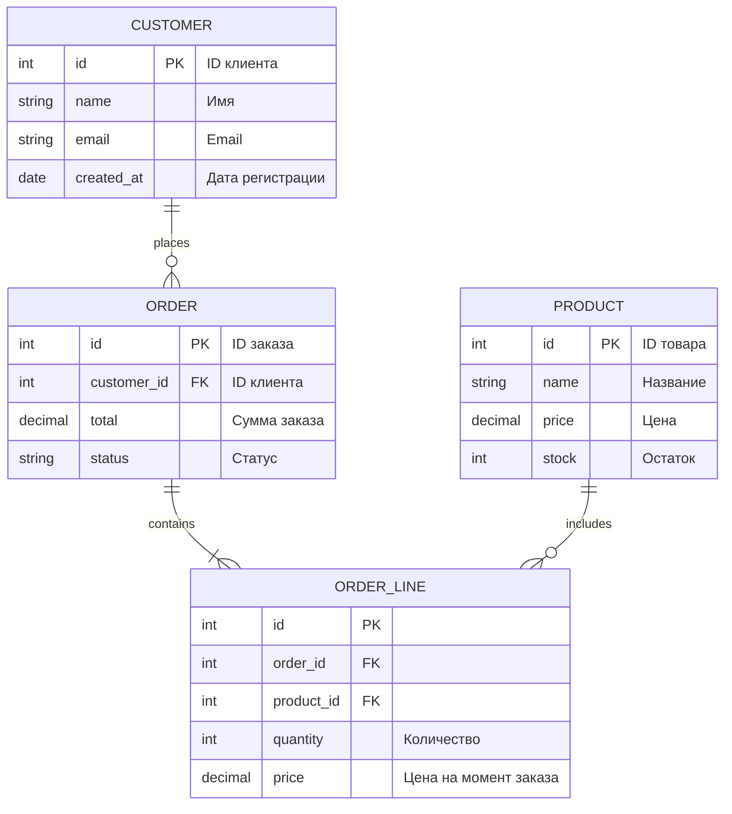
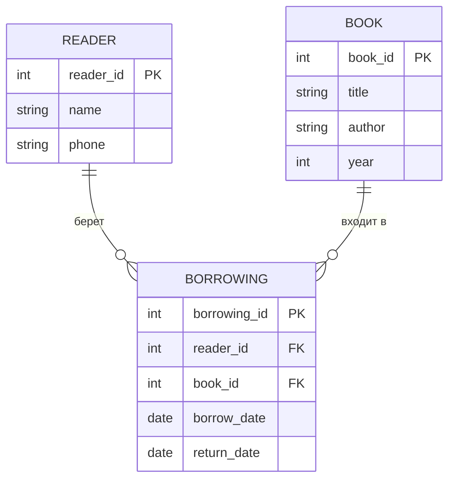
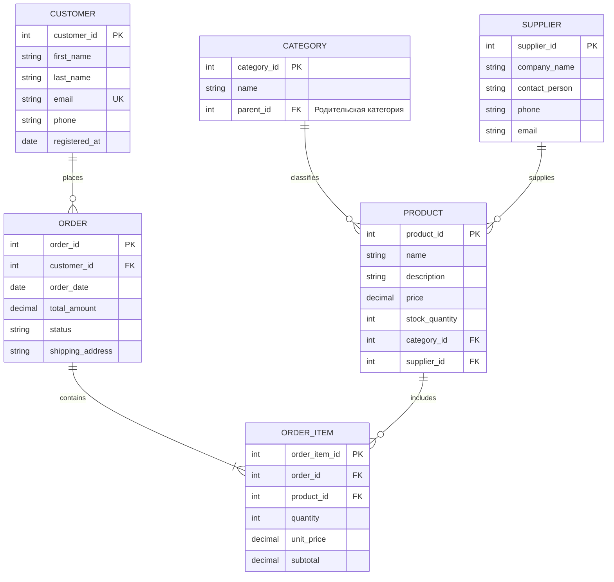
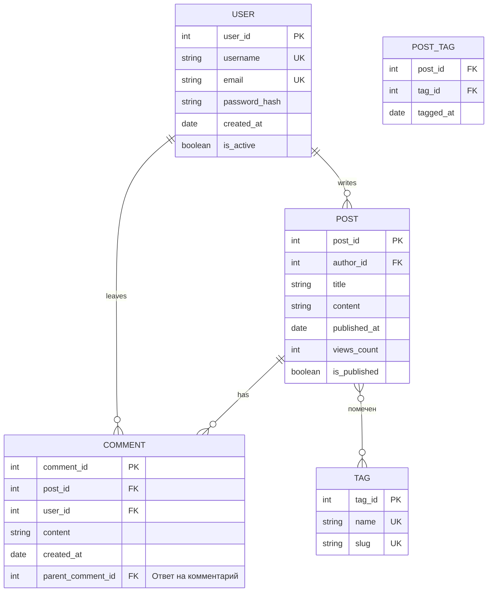
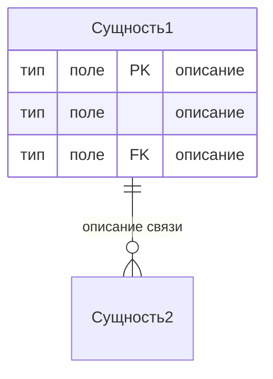
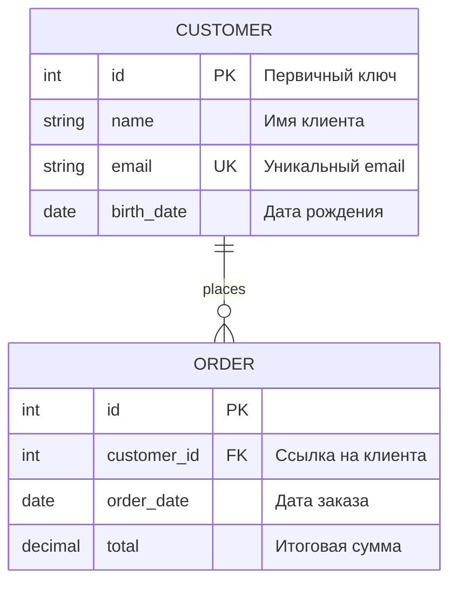
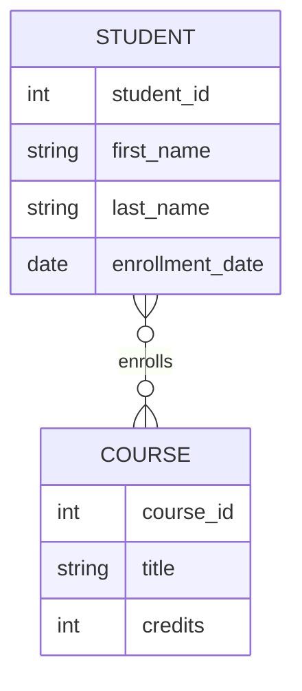
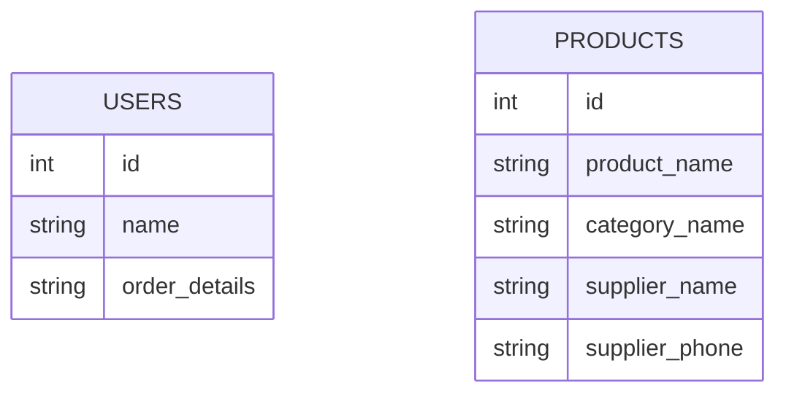

# **Практическое руководство: Создание ER-диаграмм (Data Model) для начинающих**

## **📚 Часть 1: Основы теории**

### **Что такое ER-диаграмма?**
**ER-диаграмма (Entity-Relationship Diagram)** - это визуальное представление структуры базы данных, которое показывает:
- **Сущности (Entities)** - объекты предметной области (например, "Пользователь", "Заказ")
- **Атрибуты (Attributes)** - свойства сущностей (например, "Имя", "Email", "Дата создания")
- **Связи (Relationships)** - как сущности связаны между собой

### **Три уровня абстракции:**
1. **Концептуальный** - высокоуровневый, для общения с заказчиком
2. **Логический** - детализированный, с типами данных
3. **Физический** - готовый к реализации в СУБД

---

## **🛠️ Часть 2: Базовые элементы ER-диаграмм**

### **2.1 Нотация "Вороньи лапки" (Crow's Foot) - самая популярная**



### **2.2 Обозначения связей:**
```
Один-к-одному:    ||--||
Один-ко-многим:   ||--o{
Многие-ко-многим: }o--o{
```

### **2.3 Символы кардинальности:**
```
| (один)     - обязательная связь (ровно один)
o (ноль)     - необязательная связь (ноль или один)
{ (многие)   - обязательная (один или много)
} (ноль или много) - необязательная (ноль или много)
```

---

## **🎯 Часть 3: Пошаговое создание ER-диаграммы**

### **Шаг 1: Определяем сущности**
**Правило:** Сущность = существительное в единственном числе

**Пример для интернет-магазина:**
```
✅ Правильно: Customer, Product, Order, Category
❌ Неправильно: Customers, Products (множественное число)
❌ Неправильно: Buy, Create (глаголы)
```

### **Шаг 2: Определяем атрибуты**
Для каждой сущности определяем:
1. **Первичный ключ (PK)** - уникальный идентификатор
2. **Простые атрибуты** - имя, email, дата рождения
3. **Составные атрибуты** - адрес (страна, город, улика)
4. **Производные атрибуты** - возраст (вычисляется из даты рождения)

### **Шаг 3: Определяем связи**
**Формула:** [Сущность1] [глагол] [Сущность2]

**Примеры:**
- Customer **places** Order
- Order **contains** Product
- Employee **manages** Department

### **Шаг 4: Определяем кардинальность**
**Вопросы для определения:**
1. Один Клиент может сделать сколько Заказов? (один или много)
2. Один Заказ может содержать сколько Товаров? (один или много)
3. Один Товар может быть в скольких Заказах? (ноль или много)

---

## **💻 Часть 4: Практические примеры от простого к сложному**

### **Пример 1: Простая библиотека (уровень 1)**



### **Пример 2: Интернет-магазин (уровень 2)**



### **Пример 3: Система блогов с тегами (M:N связь)**



---

## **📝 Часть 5: Практические упражнения**

### **Упражнение 1: Создайте ER-диаграмму для "Университета"**

**Требования:**
1. Студенты записываются на курсы
2. Преподаватели ведут курсы
3. Каждый курс имеет расписание
4. Студенты получают оценки

**Подсказки:**
```
Сущности: Student, Course, Teacher, Enrollment, Grade
Связи: 
  - Student enrolls in Course
  - Teacher teaches Course
  - Course has Schedule
  - Student receives Grade for Course
```

### **Упражнение 2: Нормализация базы данных**

**Дана ненормализованная таблица:**

| OrderID | CustomerName | CustomerEmail | Product1 | Price1 | Product2 | Price2 | OrderDate |
|---------|--------------|---------------|----------|--------|----------|--------|-----------|
| 1 | Иван | ivan@mail.ru | Книга | 500 | Ручка | 50 | 2024-01-15 |
| 2 | Мария | masha@mail.ru | Тетрадь | 100 | NULL | NULL | 2024-01-16 |

**Задача:** Создать нормализованную ER-диаграмму (минимум до 3NF)

---

## **🔧 Часть 6: Mermaid синтаксис для ER-диаграмм**

### **Базовый синтаксис:**


### **Поддерживаемые типы данных:**
```yaml
int, string, varchar, text, decimal, float
date, datetime, timestamp, boolean
```

### **Пример с комментариями:**


---

## **🚀 Часть 7: Best Practices и советы**

### **7.1 Правила именования:**
```sql
✅ customer (единственное число)
✅ customer_id (snake_case для полей)
✅ FK_customer_id (ясно указываем внешние ключи)
❌ Customers, CustomerTable, tblCustomer
```

### **7.2 Типичные ошибки новичков:**
1. **Избыточные связи** - создание лишних отношений
2. **Неправильная кардинальность** - 1:1 вместо 1:N
3. **Отсутствие первичных ключей** - каждая сущность должна иметь PK
4. **Хранение вычисляемых полей** - вместо этого вычисляйте на лету

### **7.3 Проверочный чеклист:**
- [ ] Все сущности имеют первичный ключ
- [ ] Связи имеют понятные названия (глаголы)
- [ ] Кардинальность определена правильно
- [ ] Нет избыточных атрибутов
- [ ] Имена соответствуют соглашениям
- [ ] Документированы сложные связи

### **7.4 Инструменты для создания:**
1. **Mermaid Live Editor** - онлайн редактор
2. **draw.io** - бесплатный инструмент
3. **Lucidchart** - профессиональный инструмент
4. **PlantUML** - текстовое описание диаграмм

---

## **📊 Часть 8: От концепции к реализации**

### **8.1 Пример полного цикла:**

**1. Концептуальная модель (общение с заказчиком):**
```
[Студент] -- записывается на --> [Курс]
[Преподаватель] -- ведет --> [Курс]
```

**2. Логическая модель (детализация):**


**3. Физическая модель (SQL DDL):**
```sql
CREATE TABLE students (
    student_id INT PRIMARY KEY AUTO_INCREMENT,
    first_name VARCHAR(50) NOT NULL,
    last_name VARCHAR(50) NOT NULL,
    enrollment_date DATE NOT NULL
);

CREATE TABLE courses (
    course_id INT PRIMARY KEY AUTO_INCREMENT,
    title VARCHAR(100) NOT NULL,
    credits INT NOT NULL
);

CREATE TABLE enrollments (
    enrollment_id INT PRIMARY KEY AUTO_INCREMENT,
    student_id INT,
    course_id INT,
    enrollment_date DATE,
    FOREIGN KEY (student_id) REFERENCES students(student_id),
    FOREIGN KEY (course_id) REFERENCES courses(course_id)
);
```

---

## **🎓 Часть 9: Домашние задания**

### **Задание 1: Система бронирования отелей**
Создайте ER-диаграмму для системы бронирования отелей:
- Гости делают бронирования
- Отели имеют номера разных категорий
- Бронирования могут быть отменены или изменены
- Гости оставляют отзывы

### **Задание 2: Социальная сеть**
Спроектируйте базу данных для социальной сети:
- Пользователи могут добавлять друзей
- Публиковать посты и фотографии
- Ставить лайки и комментировать
- Подписываться на группы

### **Задание 3: Оптимизация существующей схемы**
Дана "плохая" схема, найдите и исправьте ошибки:


---

## **📈 Часть 10: Дальнейшее развитие**

### **Что изучать дальше:**
1. **Нормальные формы** (1NF, 2NF, 3NF, BCNF)
2. **Индексы и оптимизация** производительности
3. **Денормализация** для повышения скорости чтения
4. **Шардинг и репликация** для больших объемов данных

### **Полезные ресурсы:**
- **Книга:** 

---
