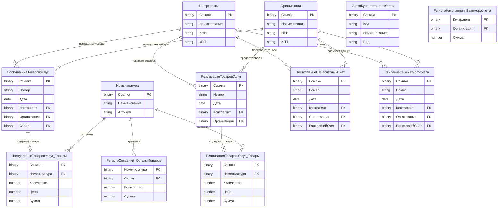

# **Практическое задание: ER-диаграмма для 1С "Бухгалтерия предприятия"**

## **🎯 Цель задания (60 минут):**
Познакомиться с основными сущностями системы 1С "Бухгалтерия предприятия" и понять связи между ними.

---

## **📋 Простое задание:**

### **Часть 1: Изучите готовую ER-диаграмму**



---

## **📝 Задание для выполнения:**

### **Часть 2: Ответьте на вопросы (15 минут)**

**Вопрос 1:** Какая связь между "Организации" и "ПоступлениеТоваровУслуг"?
- [ ] Один-к-одному
- [ ] Один-ко-многим  
- [ ] Многие-ко-многим
- [ ] Нет связи

**Вопрос 2:** Что означает обозначение `||--o{` на диаграмме?
- [ ] Один-к-одному (обязательная связь с обеих сторон)
- [ ] Один-ко-многим (обязательная с одной стороны, необязательная с другой)
- [ ] Многие-ко-многим
- [ ] Наследование

**Вопрос 3:** Сколько внешних ключей (FK) в документе "ПоступлениеТоваровУслуг"?
- [ ] 1
- [ ] 2
- [ ] 3
- [ ] 4

**Вопрос 4:** Какие сущности связаны с "Номенклатура"?
(Выберите все верные варианты)
- [ ] ПоступлениеТоваровУслуг_Товары
- [ ] РеализацияТоваровУслуг_Товары  
- [ ] РегистрСведений_ОстаткиТоваров
- [ ] Контрагенты

**Вопрос 5:** Что такое "табличная часть" в контексте 1С?
- [ ] Отдельная таблица в БД
- [ ] Часть документа, содержащая список товаров/услуг
- [ ] Вспомогательная таблица
- [ ] Регистр накопления

---

### **Часть 3: Простой анализ (15 минут)**

**Задание:** Объясните простыми словами следующие связи:

1. **"Организации → ПоступлениеТоваровУслуг"**
   Что это означает в бизнес-терминах?
   
   *Ваш ответ:*
   ____________________________________________________
   ____________________________________________________

2. **"Контрагенты → РеализацияТоваровУслуг"**
   Какую роль играет контрагент в этой связи?
   
   *Ваш ответ:*
   ____________________________________________________
   ____________________________________________________

3. **"ПоступлениеТоваровУслуг → ПоступлениеТоваровУслуг_Товары"**
   Почему товары вынесены в отдельную табличную часть?
   
   *Ваш ответ:*
   ____________________________________________________
   ____________________________________________________

4. **"Номенклатура → РегистрСведений_ОстаткиТоваров"**
   Для чего нужен этот регистр?
   
   *Ваш ответ:*
   ____________________________________________________
   ____________________________________________________

---

## **🎨 Бонусное задание (если осталось время):**

**Нарисуйте простую схему на бумаге или в любом редакторе:**

```
Организация (1) ---- (М) Поступление товаров
       |
       |
       (М) Реализация товаров
       |
       |
       (М) Движение денег
```

**Обозначьте:**
- Кто является "1" (один)
- Кто является "М" (много)  
- Направление связи

---

## **📊 Проверочный лист:**

**Правильные ответы на вопросы:**

**Вопрос 1:** ✅ **Один-ко-многим**  
*Объяснение:* Одна организация может иметь много документов поступления товаров

**Вопрос 2:** ✅ **Один-ко-многим (обязательная с одной стороны, необязательная с другой)**  
*Объяснение:* `|` - обязательная связь, `o` - необязательная, `{` - много

**Вопрос 3:** ✅ **3**  
*Объяснение:* Контрагент, Организация, Склад

**Вопрос 4:** ✅ **ПоступлениеТоваровУслуг_Товары, РеализацияТоваровУслуг_Товары, РегистрСведений_ОстаткиТоваров**  
*Объяснение:* Номенклатура связана с движением товаров и их остатками

**Вопрос 5:** ✅ **Часть документа, содержащая список товаров/услуг**  
*Объяснение:* Табличная часть хранит строки документа (например, список товаров в накладной)

---

## **💡 Примеры правильных ответов для части 3:**

1. **"Организации → ПоступлениеТоваровУслуг"**  
   *"Одна организация может получать товары много раз. Каждое поступление товаров принадлежит одной конкретной организации."*

2. **"Контрагенты → РеализацияТоваровУслуг"**  
   *"Контрагент (покупатель) может совершать множество покупок. Каждая продажа делается одному конкретному контрагенту."*

3. **"ПоступлениеТоваровУслуг → ПоступлениеТоваровУслуг_Товары"**  
   *"Один документ поступления может содержать много разных товаров. Табличная часть позволяет добавлять неограниченное количество позиций."*

4. **"Номенклатура → РегистрСведений_ОстаткиТоваров"**  
   *"Для каждого товара (номенклатуры) система хранит текущие остатки на складах. Это позволяет знать, сколько товара есть в наличии."*

---

## **✅ Критерии успешного выполнения:**

| Задание | Максимум баллов | Ваш результат |
|---------|----------------|---------------|
| Часть 2: Вопросы 1-5 | 5 баллов (по 1 за каждый) | ___ / 5 |
| Часть 3: Анализ связей | 4 балла (по 1 за каждую) | ___ / 4 |
| **Итого** | **9 баллов** | **___ / 9** |

**Оценка:**
- 8-9 баллов: Отлично! 🎉
- 6-7 баллов: Хорошо 👍  
- 4-5 баллов: Нужно повторить материал 📚
- Менее 4: Требуется изучение основ ER-диаграмм

---

## **📚 Что вы узнали из этого задания:**

1. ✅ Основные сущности 1С "Бухгалтерия предприятия"
2. ✅ Типы связей между сущностями (1:1, 1:M, M:M)
3. ✅ Обозначения на ER-диаграммах
4. ✅ Что такое табличные части в 1С
5. ✅ Как документы связаны со справочниками

---

## **🔍 Для любознательных (дополнительно):**

**Попробуйте найти в своей базе 1С:**
1. Где хранятся эти сущности?
2. Как называются поля-связи?
3. Есть ли дополнительные связи, не показанные на диаграмме?

**Пример SQL-запроса для просмотра связей:**
```sql
-- Для просмотра внешних ключей в таблице
SELECT * 
FROM INFORMATION_SCHEMA.REFERENTIAL_CONSTRAINTS
WHERE TABLE_NAME = 'Ваша_таблица';
```

---


---

