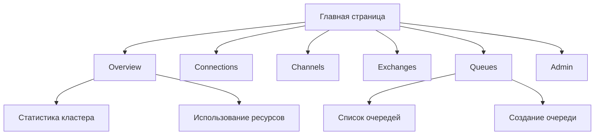
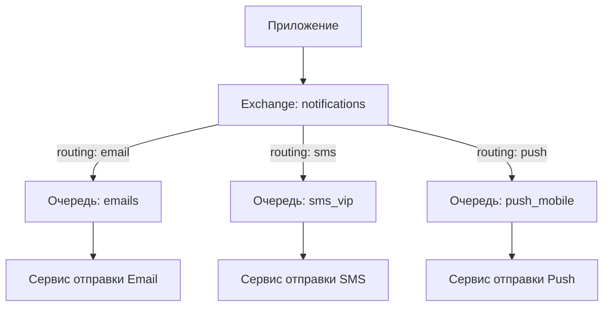

# 🐇 Практическая работа: Знакомство с RabbitMQ 

## 📋 Цель работы:
**За 2 часа понять основы работы RabbitMQ на практике, без сложной теории.**

---

## 🎯 Что вы сделаете:
1. Установите и запустите RabbitMQ
2. Поработаете в веб-интерфейсе
3. Отправите и получите сообщения
4. Создадите свою первую очередь

---

## 🚀 Часть 1: Быстрая установка (15 минут)

### Вариант A: Docker (рекомендуется)
```bash
# 1. Установите Docker если нет: https://docs.docker.com/get-docker/
# 2. Запустите RabbitMQ одной командой:
docker run -d --name rabbitmq -p 5672:5672 -p 15672:15672 rabbitmq:management

# Проверьте что работает:
docker ps
```

### Вариант B: Установка на Windows
1. Скачайте установщик: https://github.com/rabbitmq/rabbitmq-server/releases
2. Установите Erlang (требуется): https://erlang.org/downloads
3. Запустите RabbitMQ Service
4. Включите веб-интерфейс:
```cmd
cd "C:\Program Files\RabbitMQ Server\rabbitmq_server-3.13.1\sbin"
rabbitmq-plugins enable rabbitmq_management
```

### Проверка установки:
1. Откройте браузер: `http://localhost:15672`
2. Логин: `guest`
3. Пароль: `guest`
4. Должен открыться веб-интерфейс

---

## 🎮 Часть 2: Первое знакомство с интерфейсом (30 минут)

### Задание 2.1: Исследуйте веб-интерфейс


**Что сделать:**
1. Перейдите на вкладку **Overview**
2. Посмотрите статистику:
   - Количество connections
   - Количество очередей (пока 0)
   - Использование памяти
3. Нажмите на вкладку **Queues** - увидите пустой список

### Задание 2.2: Создайте первую очередь
1. Перейдите на вкладку **Queues**
2. Нажмите **"Add a new queue"**
3. Заполните:
   ```
   Name: my_first_queue
   Durability: Transient
   Auto delete: No
   Arguments: оставьте пустым
   ```
4. Нажмите **"Add queue"**
5. Увидите очередь в списке

---

## 📨 Часть 3: Отправка сообщений через веб-интерфейс (30 минут)

### Задание 3.1: Отправьте сообщение в очередь
1. В списке очередей нажмите на **my_first_queue**
2. Перейдите в раздел **"Publish message"**
3. Заполните:
   ```
   Payload: Привет, RabbitMQ!
   Properties: оставьте по умолчанию
   ```
4. Нажмите **"Publish message"**
5. Увидите: "Message published"

### Задание 3.2: Проверьте сообщение в очереди
1. На странице очереди посмотрите раздел **"Ready"**
   - Должно быть: 1 (одно сообщение)
2. Нажмите кнопку **"Get messages"**
3. Оставьте настройки по умолчанию
4. Нажмите **"Get Message(s)"**
5. Увидите ваше сообщение внизу страницы

### Задание 3.3: Практика с разными типами сообщений
1. Отправьте еще 3 сообщения:
   ```
   1. {"type": "user", "name": "Иван", "age": 30}
   2. Просто текст
   3. Пустое сообщение
   ```
2. Используйте **"Get messages"** с разными настройками:
   - Acknowledge mode: Ack message
   - Acknowledge mode: Reject message
   - Messages count: 2 (получить два сразу)

---

## 🔄 Часть 4: Работа с Exchanges (маршрутизаторами) (30 минут)

### Задание 4.1: Изучите стандартные Exchanges
1. Перейдите на вкладку **Exchanges**
2. Увидите список предустановленных exchanges:
   ```
   amq.direct   - отправка по имени очереди
   amq.fanout   - всем подключенным очередям
   amq.topic    - по шаблону ключа
   amq.headers  - по заголовкам сообщения
   ```
3. Нажмите на **amq.direct**

### Задание 4.2: Создайте связку Exchange → Queue
1. На странице **amq.direct** найдите раздел **"Bindings"**
2. В поле **"To queue"** выберите **my_first_queue**
3. В поле **Routing key** введите: `test.key`
4. Нажмите **Bind**
5. Теперь exchange знает, куда отправлять сообщения с ключом `test.key`

### Задание 4.3: Отправьте через Exchange
1. На странице **amq.direct** найдите **"Publish message"**
2. Заполните:
   ```
   Routing key: test.key
   Payload: Сообщение через exchange!
   ```
3. Нажмите **Publish**
4. Проверьте в очереди **my_first_queue** - появилось новое сообщение

---

## 🧪 Часть 5: Практические эксперименты (15 минут)

### Эксперимент 1: Две очереди, один exchange
1. Создайте новую очередь: **second_queue**
2. Свяжите ее с **amq.direct** с ключом `test.key`
3. Отправьте сообщение с ключом `test.key`
4. Проверьте обе очереди - в каждой должно быть сообщение

### Эксперимент 2: Fanout exchange
1. На странице **amq.fanout** свяжите обе очереди (без ключа!)
2. Отправьте сообщение через **amq.fanout**
3. Проверьте - сообщение появилось в ОБЕИХ очередях

### Эксперимент 3: Управление сообщениями
1. В очереди **my_first_queue** найдите раздел **"Actions"**
2. Попробуйте:
   - **Purge messages** - очистить все сообщения
   - **Delete queue** - удалить очередь
   - **Create queue** заново

---

## 📊 Часть 6: Мониторинг и наблюдение (10 минут)

### Задание 6.1: Наблюдайте за потоками данных
1. Откройте 2 вкладки браузера:
   - Вкладка 1: Очередь **my_first_queue**
   - Вкладка 2: Раздел **Queues** (общий список)
2. В другой вкладке отправляйте сообщения
3. Наблюдайте как меняются:
   - Количество сообщений (Ready)
   - Статистика на главной странице
   - Графики в Overview

### Задание 6.2: Используйте встроенные инструменты
1. В разделе **Admin** → **Users** посмотрите список пользователей
2. В разделе **Connections** посмотрите активные подключения
3. В разделе **Channels** посмотрите каналы

---

## 🎯 Итоговое задание: Мини-проект "Почтовая служба"

### Сценарий:
Вы создаете систему уведомлений для приложения. Есть 3 типа уведомлений:
1. Email - отправляется всем
2. SMS - отправляется только VIP пользователям
3. Push - отправляется мобильным пользователям

### Задача:
Создайте архитектуру в RabbitMQ для этого сценария:



### Шаги выполнения:
1. Создайте 3 очереди:
   - `email_notifications`
   - `sms_vip_notifications`
   - `push_mobile_notifications`

2. Создайте exchange типа **direct** с именем `notifications`

3. Свяжите exchange с очередями:
   - `notifications` → `email_notifications` (ключ: `email`)
   - `notifications` → `sms_vip_notifications` (ключ: `sms`)
   - `notifications` → `push_mobile_notifications` (ключ: `push`)

4. Отправьте тестовые сообщения:
   ```json
   Сообщение 1: {"routing": "email", "text": "Ваш заказ готов"}
   Сообщение 2: {"routing": "sms", "text": "Спецпредложение!"}
   Сообщение 3: {"routing": "push", "text": "Новое сообщение"}
   ```

5. Проверьте, что сообщения попали в правильные очереди

---

