# Построение интеграций в системах 1С: Работа с брокерами сообщений и обменами данных

## Введение в интеграцию 1С

Интеграция 1С с другими системами — критически важная задача для современных предприятий. Она позволяет автоматизировать бизнес-процессы, синхронизировать данные между различными системами и создавать единое информационное пространство.

## Основные подходы к интеграции

### 1. **Обмен данными через файлы**
   - Форматы: XML, JSON, CSV
   - Протоколы: FTP, SFTP, файловые шары

### 2. **Прямое подключение к БД**
   - Использование внешних источников данных
   - Прямые SQL-запросы (с ограничениями)

### 3. **Веб-сервисы и HTTP-интеграция**
   - SOAP-сервисы
   - REST API (с использованием HTTP-сервисов 1С)
   - OData-сервисы

### 4. **Брокеры сообщений (Message Brokers)**
   - Асинхронная обработка сообщений
   - Повышение надежности и масштабируемости

## Работа с брокерами сообщений в 1С

### Популярные брокеры сообщений:
1. **RabbitMQ** - наиболее распространенный выбор
2. **Apache Kafka** - для потоковой обработки больших объемов
3. **Redis Pub/Sub** - для простых сценариев
4. **ActiveMQ** - JMS-совместимый брокер

### Архитектура интеграции с RabbitMQ:

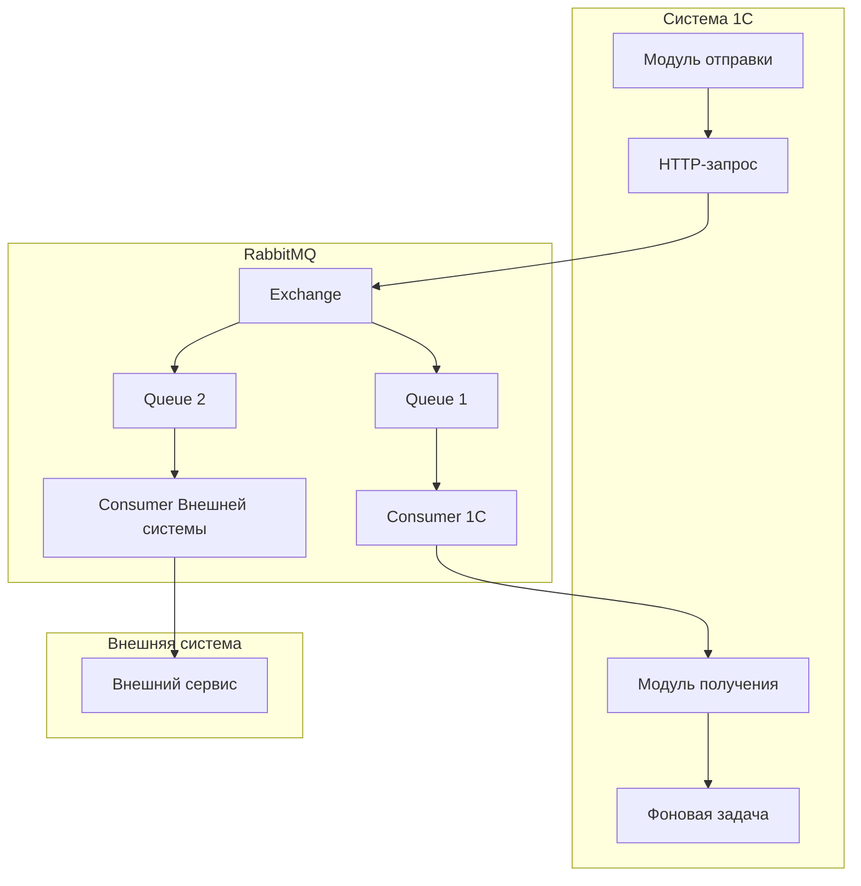

### Псевдокод реализации подключения к RabbitMQ:

```bsl
// Отправка сообщения в RabbitMQ
Процедура ОтправитьВRabbitMQ(Сообщение, Очередь) Экспорт
    
    ПараметрыСоединения = Новый Структура;
    ПараметрыСоединения.Вставить("Хост", "localhost");
    ПараметрыСоединения.Вставить("Порт", 5672);
    ПараметрыСоединения.Вставить("ВиртуальныйХост", "/");
    ПараметрыСоединения.Вставить("Логин", "guest");
    ПараметрыСоединения.Вставить("Пароль", "guest");
    
    // Использование HTTP-запроса для отправки через REST API RabbitMQ
    Запрос = Новый HTTPЗапрос("http://localhost:5672/api/queues/%2F/" + Очередь + "/publish");
    Запрос.Заголовки.Вставить("Content-Type", "application/json");
    Запрос.Заголовки.Вставить("Authorization", "Basic " + Base64Строка("guest:guest"));
    
    Тело = Новый Структура;
    Тело.Вставить("properties", Новый Структура);
    Тело.Вставить("routing_key", Очередь);
    Тело.Вставить("payload", Сообщение);
    Тело.Вставить("payload_encoding", "string");
    
    Запрос.УстановитьТелоИзСтроки(JSON.ЗаписатьJSON(Тело));
    
    HTTP = Новый HTTPСоединение("localhost", 15672);
    Ответ = HTTP.ОтправитьДляОбработки(Запрос);
    
КонецПроцедуры
```

## Обмены данных в 1С

### Встроенные механизмы обмена:
1. **Распределенные ИБ** - для однородных баз 1С
2. **Универсальный обмен данными XML** - гибкий формат
3. **Обмен через веб-сервисы** - для гетерогенных систем

### Диаграмма процесса обмена данными:

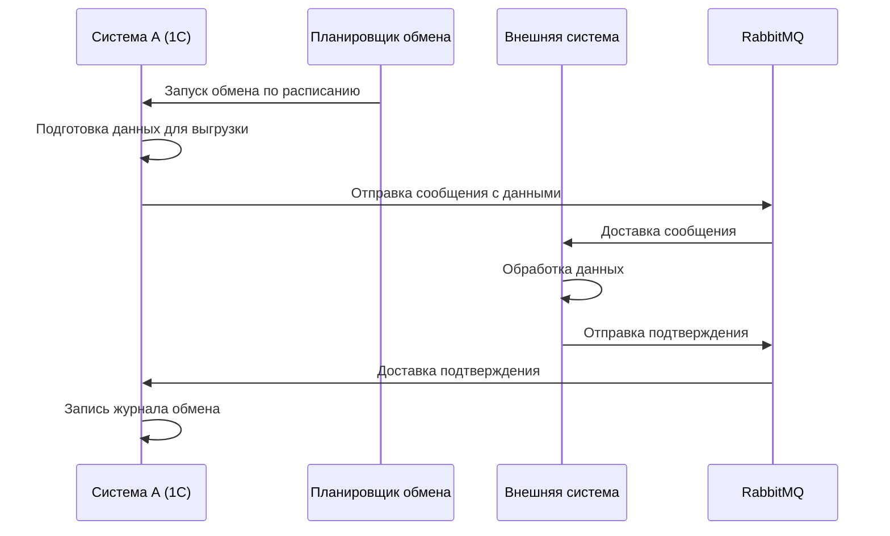

## Реализация интеграционного шины на 1С

### Компоненты интеграционной шины:

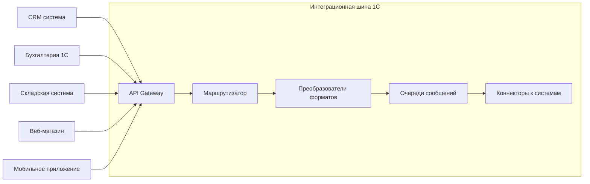

### Пример псевдокод архитектурного решения:

```bsl
// Структура модуля интеграции
#Область ИнтеграционнаяШина

// Основной обработчик входящих сообщений
Процедура ОбработатьВходящееСообщение(СообщениеJSON) Экспорт
    
    Данные = JSON.ПрочитатьJSON(СообщениеJSON);
    
    // Маршрутизация по типу сообщения
    ТипСообщения = Данные.ТипСообщения;
    
    Выбор ТипСообщения
        Когда "ЗаказКлиента":
            ОбработатьЗаказ(Данные);
        Когда "ПоступлениеТовара":
            ОбработатьПоступление(Данные);
        Когда "Оплата":
            ОбработатьОплату(Данные);
    КонецВыбора;
    
КонецПроцедуры;

// Отправка в шину
Функция ОтправитьВШину(Данные, Тип, Приоритет) Экспорт
    
    Сообщение = Новый Структура;
    Сообщение.Вставить("Идентификатор", Новый УникальныйИдентификатор());
    Сообщение.Вставить("ВремяОтправки", ТекущаяДата());
    Сообщение.Вставить("ТипСообщения", Тип);
    Сообщение.Вставить("Данные", Данные);
    Сообщение.Вставить("Приоритет", Приоритет);
    
    // Отправка в RabbitMQ
    Возврат ОтправитьВОчередь(JSON.ЗаписатьJSON(Сообщение), "integration_bus");
    
КонецФункции;

#КонецОбласти
```

## Паттерны проектирования интеграций

### 1. **Point-to-Point**
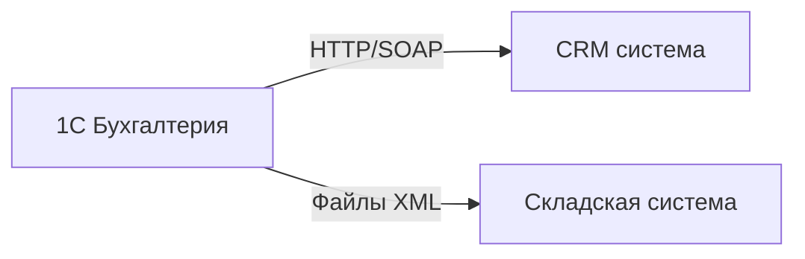

### 2. **Hub-and-Spoke через шину**
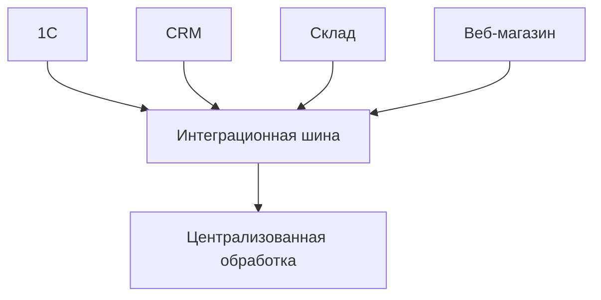

### 3. **Event-Driven Architecture**
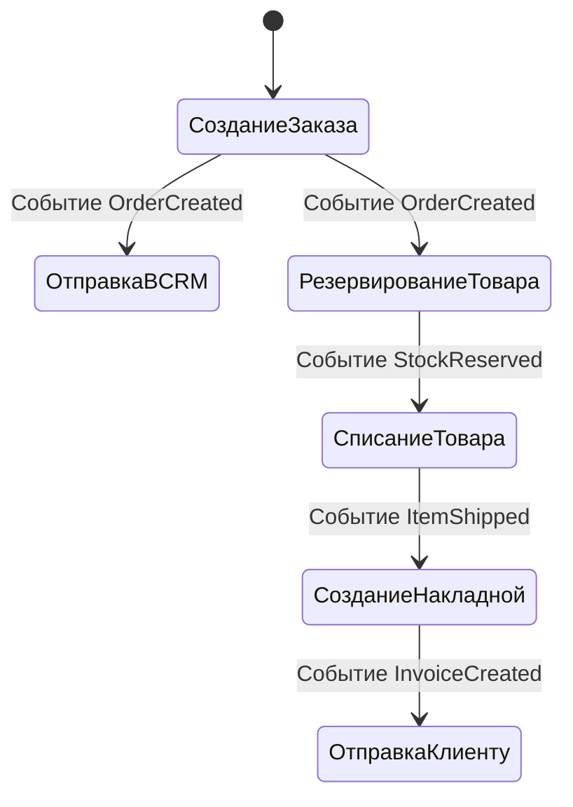

## Обработка ошибок и мониторинг

### Диаграмма обработки ошибок:

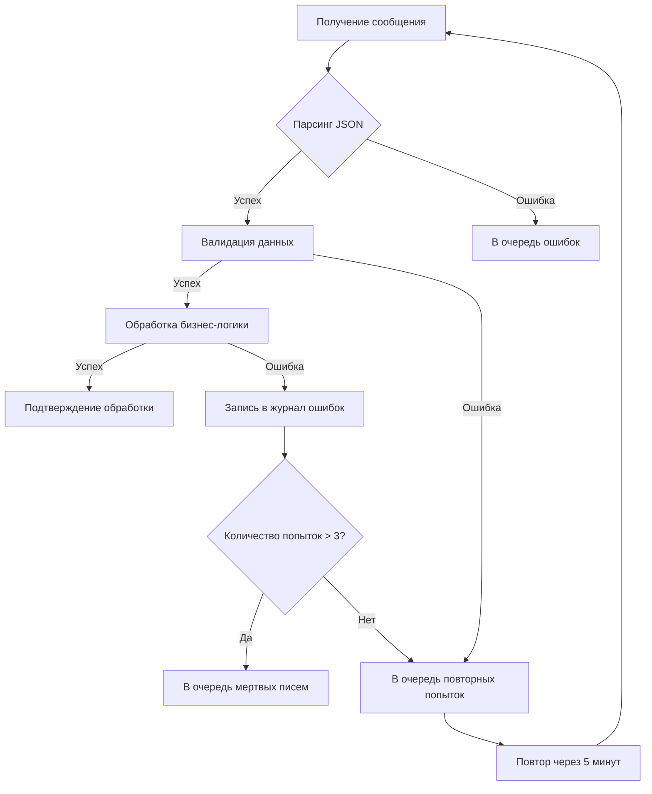

### Реализация механизма повторных попыток:

```bsl
// Обработчик с механизмом retry
Процедура ОбработатьСПовтором(Сообщение, МаксПопыток = 3)
    
    Попытка = 1;
    Пока Попытка <= МаксПопыток Цикл
        
        Попытка
            ОбработатьСообщение(Сообщение);
            Прервать;
        Исключение
            Если Попытка = МаксПопыток Тогда
                ЗаписатьВЖурналОшибок(Сообщение, ОписаниеОшибки());
                ОтправитьВОчередьМертвыхПисем(Сообщение);
            Иначе
                Ждать(Попытка * 30000); // Экспоненциальная задержка
            КонецЕсли;
            
            Попытка = Попытка + 1;
        КонецПопытки;
        
    КонецЦикла;
    
КонецПроцедуры;
```

## Оптимизация производительности

### Рекомендации:

1. **Пакетная обработка** - группировка сообщений
2. **Асинхронность** - использование фоновых заданий
3. **Кэширование** - часто используемых данных
4. **Ограничение частоты** (rate limiting) запросов
5. **Мониторинг очередей** и своевременное масштабирование

### Пример пакетной обработки:

```bsl
// Пакетная отправка документов
Процедура ОтправитьПакетДокументов(МассивДокументов)
    
    Пакет = Новый Массив;
    Для Каждого Документ Из МассивДокументов Цикл
        Пакет.Добавить(ПодготовитьДляОтправки(Документ));
        
        // Отправляем пачками по 100 документов
        Если Пакет.Количество() >= 100 Тогда
            ОтправитьПакетВШину(Пакет);
            Пакет = Новый Массив;
        КонецЕсли;
    КонецЦикла;
    
    // Отправить остатки
    Если Пакет.Количество() > 0 Тогда
        ОтправитьПакетВШину(Пакет);
    КонецЕсли;
    
КонецПроцедуры;
```

## Безопасность интеграций

### Меры безопасности:

1. **Аутентификация и авторизация**
2. **Шифрование передаваемых данных** (TLS/SSL)
3. **Валидация входящих данных**
4. **Ограничение доступа по IP**
5. **Журналирование операций**

### Пример безопасного подключения:

```bsl
// Защищенное подключение к внешнему сервису
Функция БезопасныйВызовAPI(Метод, Данные, КлючAPI)
    
    Запрос = Новый HTTPЗапрос(Метод);
    
    // Заголовки безопасности
    Запрос.Заголовки.Вставить("X-API-Key", КлючAPI);
    Запрос.Заголовки.Вставить("X-Request-ID", Новый УникальныйИдентификатор());
    Запрос.Заголовки.Вставить("X-Timestamp", Формат(ТекущаяДата(), "ДФ=yyyy-MM-ddTHH:mm:ss.zzz"));
    
    // Подпись запроса
    Подпись = ПолучитьПодписьЗапроса(Метод, Данные, КлючAPI);
    Запрос.Заголовки.Вставить("X-Signature", Подпись);
    
    // Шифрование данных
    Если Не ПустаяСтрока(Данные) Тогда
        Запрос.УстановитьТелоИзСтроки(ЗашифроватьДанные(Данные));
    КонецЕсли;
    
    // Использование HTTPS
    HTTP = Новый HTTPСоединение("api.example.com", 443, , , , 30, Новый ЗащищенноеСоединениеOpenSSL());
    
    Возврат HTTP.Получить(Запрос);
    
КонецФункции;
```


# Подробное объяснение механизма работы очередей и интеграции RabbitMQ с 1С

## 📚 Часть 1: Основы очередей сообщений 

### Что такое очередь сообщений?

Представьте себе почтовое отделение:
- **Отправители** (Producers) кладут письма в ящик
- **Почтовые ящики** (Queues) хранят письма
- **Почтальоны** (Consumers) забирают письма и доставляют адресатам

### Пошаговый механизм работы очереди:

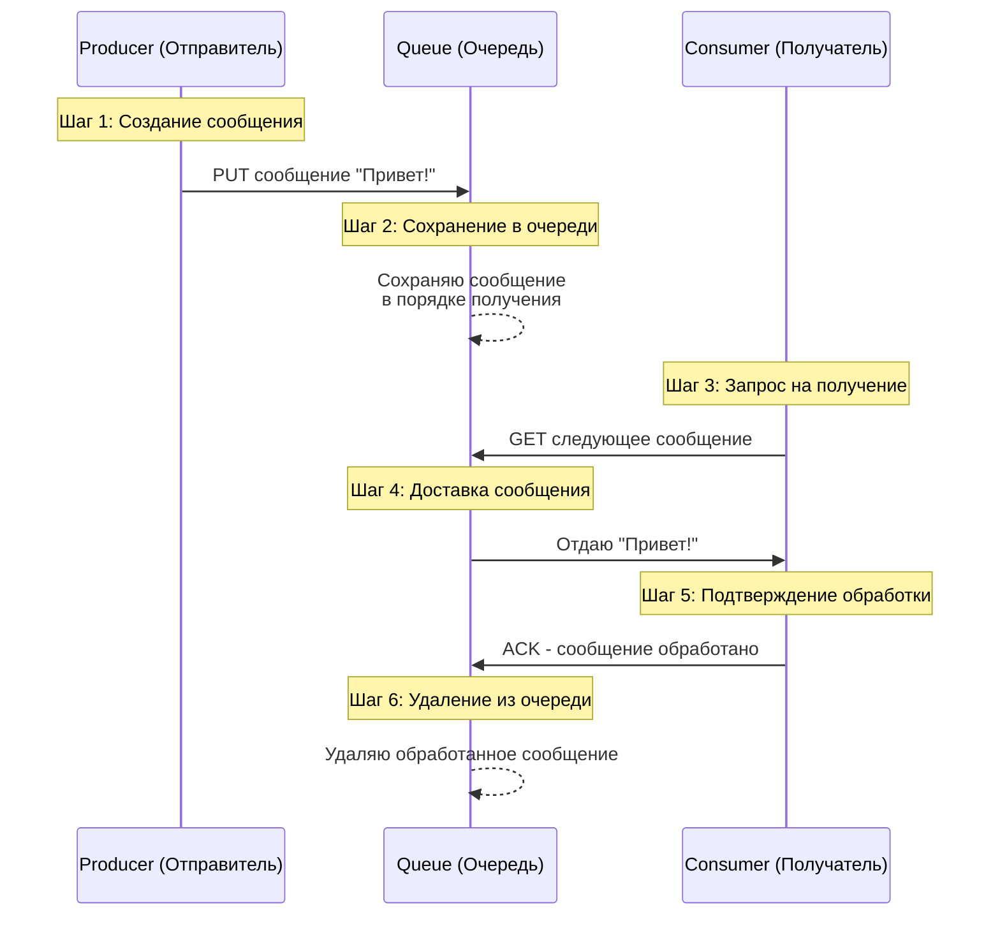

### Детальный разбор каждого шага:

#### **Шаг 1: Отправка сообщения**
```javascript
// Producer отправляет сообщение
message = {
    id: "12345",
    body: "Новый заказ №456",
    timestamp: "2024-01-15 10:30:00"
}
queue.put(message) // Отправляем в очередь
```

#### **Шаг 2: Хранение в очереди**
```
Очередь "Заказы":
┌─────────────────┐
│ Сообщение 1     │ ← Первое в очереди (FIFO)
├─────────────────┤
│ Сообщение 2     │
├─────────────────┤
│ Сообщение 3     │
├─────────────────┤
│ Сообщение 4     │ ← Последнее в очереди
└─────────────────┘
```

#### **Шаг 3: Получение сообщения**
```javascript
// Consumer запрашивает сообщение
message = queue.get() // Берет первое сообщение
// Очередь БЛОКИРУЕТ это сообщение от других consumers
```

#### **Шаг 4-6: Обработка и подтверждение**
```javascript
try {
    process(message) // Обрабатываем сообщение
    queue.ack(message.id) // Подтверждаем успешную обработку
    // Сообщение УДАЛЯЕТСЯ из очереди
} catch (error) {
    queue.nack(message.id) // Отказываемся от сообщения
    // Сообщение возвращается в очередь или<br>отправляется в очередь ошибок
}
```

## 🔧 Часть 2: Почему 1С не может работать с RabbitMQ напрямую

### Технические ограничения платформы 1С:

#### **1. Отсутствие нативных клиентских библиотек**
```bsl
// В 1С НЕТ встроенных классов для работы с AMQP
// Так работать НЕ получится:

// ❌ ЭТО НЕ СРАБОТАЕТ!
Попытка
    Соединение = Новый AMQPСоединение("localhost", 5672); // Нет такого класса!
    Канал = Соединение.СоздатьКанал(); // Нет такого метода!
Исключение
    Сообщить("AMQP не поддерживается в 1С нативно");
КонецПопытки;
```

#### **2. Протокол AMQP требует низкоуровневых операций**
```
AMQP Frame Structure:
0      1         3         7          size+7     size+8
+------+---------+---------+----------------+-----------+
| type | channel |  size   |   payload      | frame-end |
+------+---------+---------+----------------+-----------+
  byte   short     long     size octets        byte

1С не может работать с бинарными фреймами AMQP напрямую!
```

#### **3. Проблема с постоянными соединениями**
```bsl
// RabbitMQ требует поддержания постоянного TCP-соединения
// 1С плохо работает с долгоживущими соединениями:

// ❌ Проблемный код:
Соединение = Новый TCPСоединение("localhost", 5672);
Пока Истина Цикл // Бесконечный цикл
    Ждать(1000); // Ожидание сообщений
    // Соединение может разорваться из-за таймаутов
    // 1С не предназначен для такого использования
КонецЦикла;
```

### Сравнение возможностей:

| Протокол | Поддержка в 1С | Пример использования |
|----------|----------------|----------------------|
| **HTTP/REST** | ✅ Полная поддержка | `Новый HTTPСоединение()` |
| **SOAP** | ✅ Полная поддержка | `Новый WSПрокси()` |
| **FTP/SFTP** | ✅ Полная поддержка | `Новый FTPСоединение()` |
| **AMQP** | ❌ Нет поддержки | Требуется промежуточный слой |
| **Kafka Protocol** | ❌ Нет поддержки | Требуется промежуточный слой |

## 🌉 Часть 3: Решения для интеграции RabbitMQ с 1С

### Вариант 1: REST API RabbitMQ (Наиболее простой)

#### Как это работает:

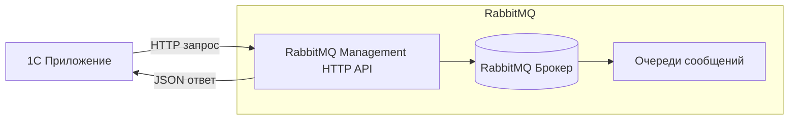

#### Включение REST API в RabbitMQ:

```bash
# 1. Установка RabbitMQ с плагином управления
rabbitmq-plugins enable rabbitmq_management

# 2. После установки доступны:
# Web UI: http://localhost:15672
# REST API: http://localhost:15672/api/
```

### Вариант 2: Промежуточный сервис (Middleware)

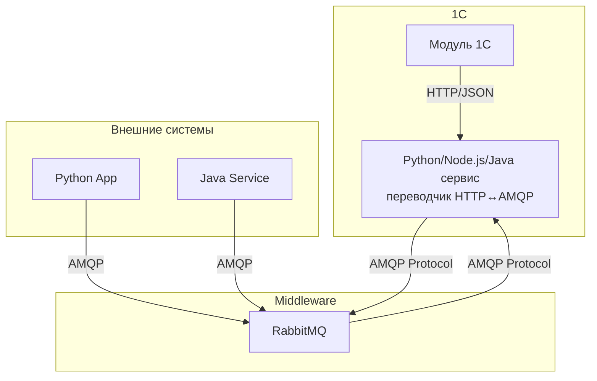

## 📡 Часть 4: Детальная работа через REST API RabbitMQ

### Архитектура REST API RabbitMQ:

```
RabbitMQ Management REST API
├── /api/connections     - Управление соединениями
├── /api/channels        - Управление каналами
├── /api/exchanges       - Управление exchanges
├── /api/queues          - Управление очередями
├── /api/bindings        - Управление привязками
└── /api/vhosts          - Управление виртуальными хостами
```

### Пошаговая реализация в 1С:

#### **Шаг 1: Настройка подключения**
```bsl
// Конфигурация подключения
Функция ПолучитьПараметрыПодключения()
    
    Параметры = Новый Структура;
    Параметры.Вставить("Хост", "localhost");
    Параметры.Вставить("Порт", 15672); // Порт HTTP API
    Параметры.Вставить("ВиртуальныйХост", "%2F"); // Кодированный "/"
    Параметры.Вставить("Логин", "guest");
    Параметры.Вставить("Пароль", "guest");
    Параметры.Вставить("БазовыйURL", 
        "http://" + Параметры.Хост + ":" + Параметры.Порт + "/api/");
    
    Возврат Параметры;
    
КонецФункции
```

#### **Шаг 2: Отправка сообщения в очередь**
```bsl
// Отправка сообщения через REST API
Функция ОтправитьСообщение(ИмяОчереди, ТелоСообщения, Заголовки = Неопределено) Экспорт
    
    Параметры = ПолучитьПараметрыПодключения();
    
    // 1. Подготовка URL
    URL = Параметры.БазовыйURL + 
          "exchanges/" + Параметры.ВиртуальныйХост + 
          "/amq.default/publish";
    
    // 2. Формирование тела запроса
    ТелоЗапроса = Новый Структура;
    ТелоЗапроса.Вставить("properties", Новый Структура);
    
    Если Заголовки <> Неопределено Тогда
        ТелоЗапроса.properties.Вставить("headers", Заголовки);
    КонецЕсли;
    
    ТелоЗапроса.Вставить("routing_key", ИмяОчереди);
    ТелоЗапроса.Вставить("payload", ТелоСообщения);
    ТелоЗапроса.Вставить("payload_encoding", "string");
    
    // 3. Создание HTTP запроса
    Запрос = Новый HTTPЗапрос(URL);
    Запрос.Метод = "POST";
    Запрос.Заголовки.Вставить("Content-Type", "application/json");
    
    // 4. Базовая аутентификация
    Креденшиалы = Параметры.Логин + ":" + Параметры.Пароль;
    Запрос.Заголовки.Вставить("Authorization", 
        "Basic " + Base64Строка(Креденшиалы));
    
    // 5. Установка тела
    JSONТекст = JSON.ЗаписатьJSON(ТелоЗапроса);
    Запрос.УстановитьТелоИзСтроки(JSONТекст);
    
    // 6. Отправка запроса
    Попытка
        HTTP = Новый HTTPСоединение(Параметры.Хост, Параметры.Порт);
        Ответ = HTTP.ОтправитьДляОбработки(Запрос);
        
        Если Ответ.КодСостояния = 200 Тогда
            Результат = JSON.ПрочитатьJSON(Ответ.ПолучитьТелоКакСтроку());
            Возврат Результат.routed = Истина;
        Иначе
            ВызватьИсключение "Ошибка отправки: " + Ответ.КодСостояния;
        КонецЕсли;
    Исключение
        // Обработка ошибок сети
        ЗаписатьВЖурналОшибок(ОписаниеОшибки());
        Возврат Ложь;
    КонецПопытки;
    
КонецФункции
```

#### **Шаг 3: Получение сообщений из очереди**
```bsl
// Получение сообщений через REST API
Функция ПолучитьСообщение(ИмяОчереди, УдалитьПослеПолучения = Истина) Экспорт
    
    Параметры = ПолучитьПараметрыПодключения();
    
    // 1. Подготовка URL
    URL = Параметры.БазовыйURL + 
          "queues/" + Параметры.ВиртуальныйХост + 
          "/" + ИмяОчереди + "/get";
    
    // 2. Формирование тела запроса для получения
    ТелоЗапроса = Новый Структура;
    ТелоЗапроса.Вставить("count", 1); // Получить одно сообщение
    ТелоЗапроса.Вставить("ackmode", "ack_requeue_false"); // Удалить после получения
    ТелоЗапроса.Вставить("encoding", "auto");
    
    Если Не УдалитьПослеПолучения Тогда
        ТелоЗапроса.ackmode = "ack_requeue_true"; // Вернуть в очередь
    КонецЕсли;
    
    // 3. Создание HTTP запроса
    Запрос = Новый HTTPЗапрос(URL);
    Запрос.Метод = "POST";
    Запрос.Заголовки.Вставить("Content-Type", "application/json");
    Запрос.Заголовки.Вставить("Authorization", 
        "Basic " + Base64Строка(Параметры.Логин + ":" + Параметры.Пароль));
    
    JSONТекст = JSON.ЗаписатьJSON(ТелоЗапроса);
    Запрос.УстановитьТелоИзСтроки(JSONТекст);
    
    // 4. Отправка запроса
    HTTP = Новый HTTPСоединение(Параметры.Хост, Параметры.Порт);
    Ответ = HTTP.ОтправитьДляОбработки(Запрос);
    
    Если Ответ.КодСостояния = 200 Тогда
        Результат = JSON.ПрочитатьJSON(Ответ.ПолучитьТелоКакСтроку());
        
        Если Результат.Количество() > 0 Тогда
            // Возвращаем первое сообщение
            Сообщение = Результат[0];
            Возврат Сообщение;
        КонецЕсли;
    КонецЕсли;
    
    Возврат Неопределено;
    
КонецФункции
```

#### **Шаг 4: Мониторинг очереди**
```bsl
// Проверка состояния очереди
Функция ПолучитьСтатистикуОчереди(ИмяОчереди) Экспорт
    
    Параметры = ПолучитьПараметрыПодключения();
    
    URL = Параметры.БазовыйURL + 
          "queues/" + Параметры.ВиртуальныйХост + 
          "/" + ИмяОчереди;
    
    Запрос = Новый HTTPЗапрос(URL);
    Запрос.Метод = "GET";
    Запрос.Заголовки.Вставить("Authorization", 
        "Basic " + Base64Строка(Параметры.Логин + ":" + Параметры.Пароль));
    
    HTTP = Новый HTTPСоединение(Параметры.Хост, Параметры.Порт);
    Ответ = HTTP.Получить(Запрос);
    
    Если Ответ.КодСостояния = 200 Тогда
        Данные = JSON.ПрочитатьJSON(Ответ.ПолучитьТелоКакСтроку());
        
        Статистика = Новый Структура;
        Статистика.Вставить("Имя", Данные.name);
        Статистика.Вставить("Сообщения", Данные.messages);
        Статистика.Вставить("СообщенияГотовы", Данные.messages_ready);
        Статистика.Вставить("СообщенияНеПодтверждены", Данные.messages_unacknowledged);
        Статистика.Вставить("Потребители", Данные.consumers);
        
        Возврат Статистика;
    КонецЕсли;
    
    Возврат Неопределено;
    
КонецФункции
```

## 🛠️ Часть 5: Полный пример использования

### Реализация фоновой обработки заказов:

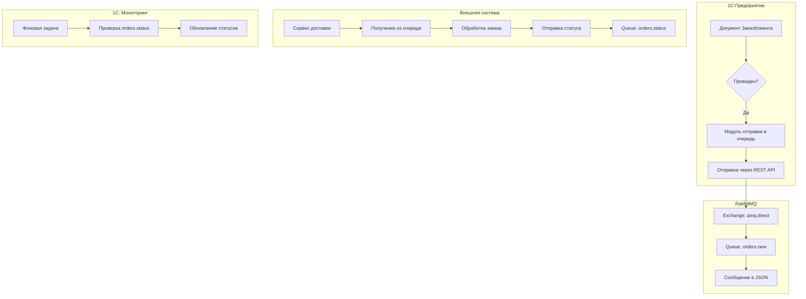

### Код полной реализации:

```bsl
#Область МенеджерОчередей

// Основной класс для работы с RabbitMQ через REST API
Класс МенеджерRabbitMQ
    
    // Параметры подключения
    ПараметрыПодключения;
    
    // Инициализация
    Процедура ПриСозданииОбъекта(Хост = "localhost", Порт = 15672, 
                                 Логин = "guest", Пароль = "guest")
        
        ПараметрыПодключения = Новый Структура;
        ПараметрыПодключения.Вставить("Хост", Хост);
        ПараметрыПодключения.Вставить("Порт", Порт);
        ПараметрыПодключения.Вставить("Логин", Логин);
        ПараметрыПодключения.Вставить("Пароль", Пароль);
        ПараметрыПодключения.Вставить("ВиртуальныйХост", "%2F");
        ПараметрыПодключения.Вставить("БазовыйURL", 
            "http://" + Хост + ":" + Порт + "/api/");
        
    КонецПроцедуры
    
    // Отправка документа в очередь
    Функция ОтправитьДокументВОчередь(Документ, ИмяОчереди) Экспорт
        
        // 1. Подготовка данных документа
        ДанныеДокумента = ПодготовитьДанныеДокумента(Документ);
        
        // 2. Формирование сообщения
        Сообщение = Новый Структура;
        Сообщение.Вставить("Идентификатор", Новый УникальныйИдентификатор());
        Сообщение.Вставить("ТипДокумента", Документ.Метаданные().Имя);
        Сообщение.Вставить("ИдентификаторДокумента", Документ.Ссылка.УникальныйИдентификатор());
        Сообщение.Вставить("ДатаВремя", ТекущаяДата());
        Сообщение.Вставить("Данные", ДанныеДокумента);
        
        // 3. Конвертация в JSON
        JSONСообщение = JSON.ЗаписатьJSON(Сообщение);
        
        // 4. Отправка в очередь
        Возврат ОтправитьСообщение(ИмяОчереди, JSONСообщение);
        
    КонецФункции
    
    // Получение и обработка сообщений
    Процедура ОбработатьОчередь(ИмяОчереди, ОбработчикСообщения) Экспорт
        
        Попытка
            // Получаем сообщение
            Сообщение = ПолучитьСообщение(ИмяОчереди, Истина);
            
            Если Сообщение = Неопределено Тогда
                // Нет сообщений в очереди
                Возврат;
            КонецЕсли;
            
            // Извлекаем данные
            JSONДанные = Сообщение.payload;
            Данные = JSON.ПрочитатьJSON(JSONДанные);
            
            // Вызываем обработчик
            ОбработчикСообщения(Данные);
            
        Исключение
            // Логируем ошибку
            ЗаписатьВЖурналОшибок("Ошибка обработки очереди: " + 
                                 ОписаниеОшибки());
            
            // Возвращаем сообщение в очередь
            Если Сообщение <> Неопределено Тогда
                // Можно отправить в очередь ошибок
                ОтправитьСообщение("errors", JSONДанные);
            КонецЕсли;
        КонецПопытки;
        
    КонецПроцедуры
    
    // Приватные методы
    Функция ОтправитьСообщение(ИмяОчереди, Тело)
        // Реализация из предыдущего примера
    КонецФункции
    
    Функция ПолучитьСообщение(ИмяОчереди, Удалить)
        // Реализация из предыдущего примера
    КонецФункции
    
КонецКласса

#КонецОбласти
```

## ⚠️ Часть 6: Ограничения и рекомендации

### Ограничения REST API подхода:

1. **Производительность**:
   - HTTP-запросы медленнее, чем AMQP
   - Нет поддержки push-уведомлений
   - Нужно постоянно опрашивать очередь

2. **Функциональность**:
   - Не все функции RabbitMQ доступны
   - Ограниченная работа с подтверждениями
   - Нет транзакций

3. **Надежность**:
   - HTTP может терять соединения
   - Нет гарантий доставки как в AMQP

### Рекомендации для production:

#### **1. Используйте промежуточный сервис для критичных систем**
```python
# Пример Python сервиса-переводчика
from flask import Flask, request
import pika
import json

app = Flask(__name__)

# Подключение к RabbitMQ
connection = pika.BlockingConnection(pika.ConnectionParameters('localhost'))
channel = connection.channel()

@app.route('/api/send', methods=['POST'])
def send_message():
    data = request.json
    channel.basic_publish(
        exchange='',
        routing_key=data['queue'],
        body=json.dumps(data['message'])
    )
    return {'status': 'sent'}

if __name__ == '__main__':
    app.run(port=5000)
```

#### **2. Реализуйте фоновую задачу для опроса очередей в 1С**
```bsl
// Фоновая задача для обработки очереди
Процедура ОбработкаОчередиВФоне() Экспорт
    
    Менеджер = Новый МенеджерRabbitMQ();
    
    Пока Истина Цикл
        
        Попытка
            // Обрабатываем очередь заказов
            Менеджер.ОбработатьОчередь("orders.new", 
                ОбработчикНовыхЗаказов);
            
            // Обрабатываем очередь статусов
            Менеджер.ОбработатьОчередь("orders.status",
                ОбработчикСтатусовЗаказов);
            
            // Ждем перед следующей проверкой
            Ждать(5000); // 5 секунд
            
        Исключение
            // Логируем и продолжаем
            ЗаписатьВЖурналОшибок(ОписаниеОшибки());
            Ждать(30000); // Ждем дольше при ошибке
        КонецПопытки;
        
    КонецЦикла;
    
КонецПроцедуры
```

#### **3. Настройте мониторинг**
```bsl
// Мониторинг состояния очередей
Процедура ПроверитьСостояниеОчередей()
    
    Менеджер = Новый МенеджерRabbitMQ();
    Очереди = Новый Массив;
    Очереди.Добавить("orders.new");
    Очереди.Добавить("orders.status");
    Очереди.Добавить("errors");
    
    Для Каждого Очередь Из Очереди Цикл
        Статистика = Менеджер.ПолучитьСтатистикуОчереди(Очередь);
        
        Если Статистика <> Неопределено Тогда
            // Проверяем критичные условия
            Если Статистика.Сообщения > 1000 Тогда
                ОтправитьУведомление("Очередь " + Очередь + 
                                   " переполнена: " + 
                                   Статистика.Сообщения);
            КонецЕсли;
        КонецЕсли;
    КонецЦикла;
    
КонецПроцедуры
```

