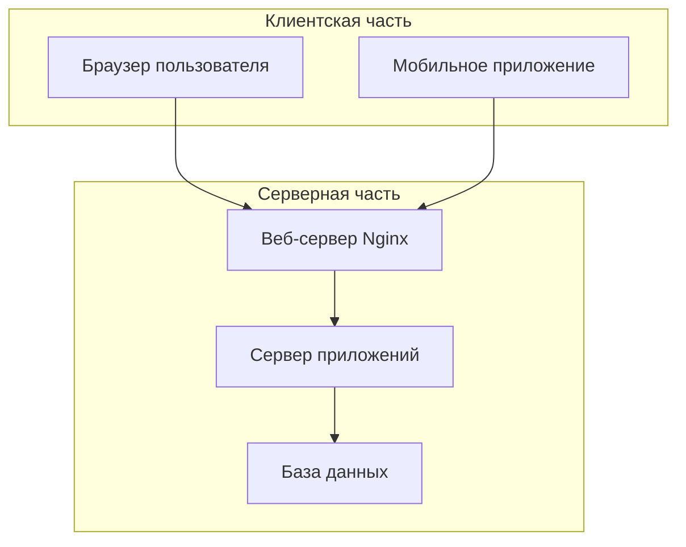
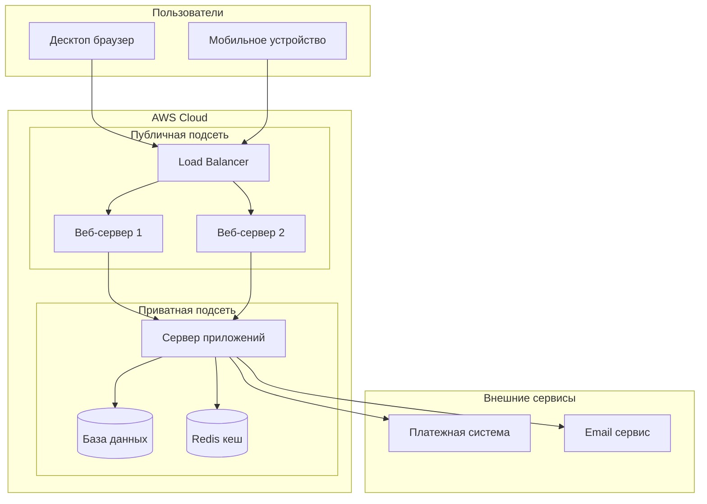
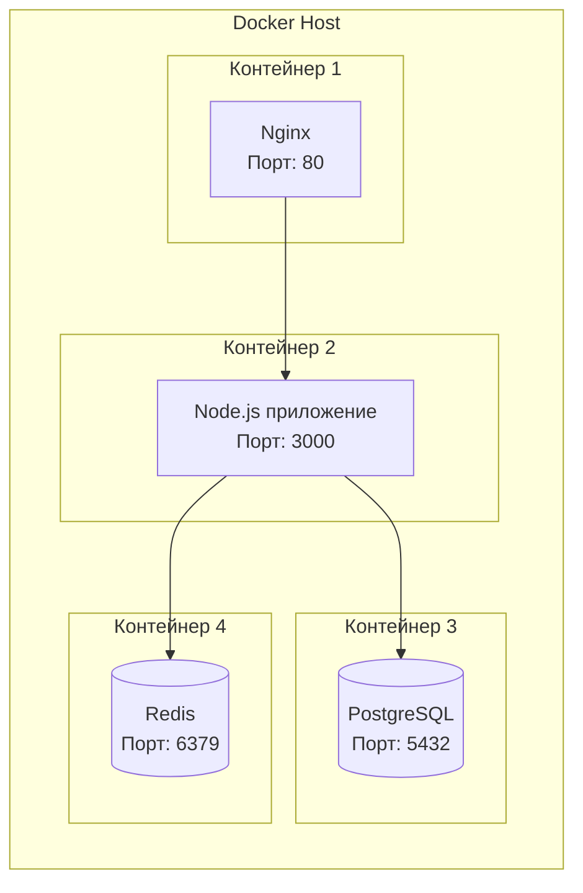
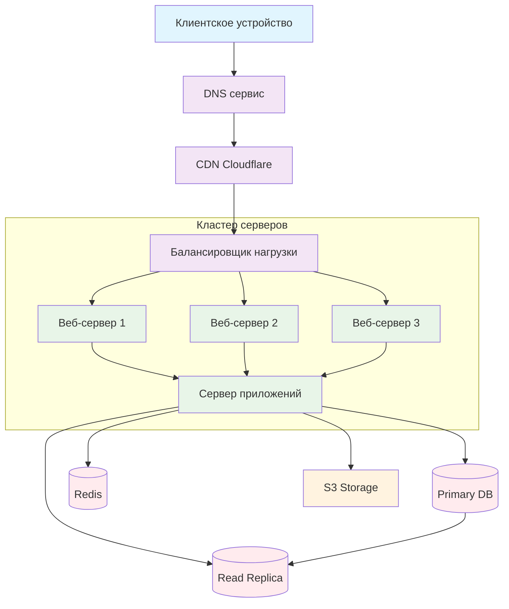

## **Синтаксис для диаграмм развертывания в Mermaid**

### **Основной синтаксис:**

```
%% Изначально был deploymentDiagram, но сейчас используется:
deployDiagram
```

**Но есть проблема:** В последних версиях Mermaid диаграммы развертывания были **переработаны** и теперь используют другой подход. Давайте рассмотрим реальные примеры:

### **Пример 1: Простая диаграмма развертывания**



### **Пример 2: Более сложная архитектура**



### **Пример 3: Контейнерная архитектура**



### **Пример 4: Полная система с пояснениями**



## **Ключевые моменты:**

1. **В текущей версии Mermaid** для диаграмм развертывания лучше использовать:
   - `graph` / `flowchart` для структурных схем
   - `subgraph` для группировки компонентов

2. **Основные элементы:**
   - Прямоугольники `[компонент]` для узлов
   - Скругленные прямоугольники `(база данных)` для хранилищ
   - Стрелки `-->` для связей
   - Подграфы `subgraph` для группировки

3. **Для настоящих UML Deployment Diagrams** лучше использовать специализированные инструменты:
   - PlantUML
   - Draw.io
   - Lucidchart
   - Visual Paradigm

