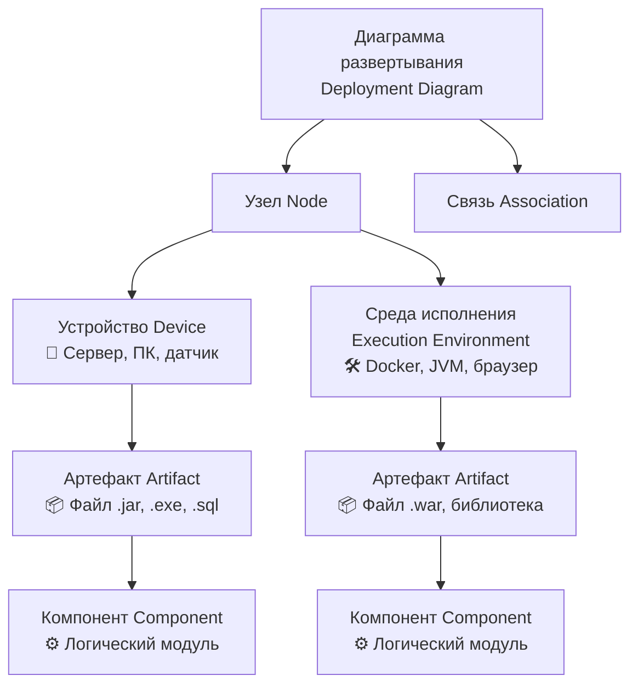

---

## **Практическое руководство по созданию диаграмм развертывания (Deployment Diagram) в UML 2.0**

**Диаграмма развертывания** — это статическая структурная диаграмма, которая показывает физическое размещение компонентов программного обеспечения на "железных" узлах (серверах, устройствах, средах исполнения) и конфигурацию связей между ними.

**Ключевая цель:** Визуализировать **физическую архитектуру** системы: что, где и как работает "в железе".

### **📌 1. Ключевые элементы синтаксиса (Нотация)**

Вот блок-схема, которая показывает **иерархию и связь основных элементов** диаграммы развертывания:


#### **1.1. Узел (Node) — основа диаграммы**
Узел — это физический объект, представляющий вычислительный ресурс. Обозначается **кубом** (в UML 1.x был объемным, в 2.0 часто рисуют как прямоугольник с меткой `<<node>>` или значком).

*   **Стереотипы (важные подтипы):**
    *   **`<<device>>`** — аппаратное устройство (сервер, ПК, роутер, датчик).
        *   **Пример:** `<<device>> Веб-сервер`, `<<device>> Мобильный телефон`.
    *   **`<<executionEnvironment>>`** (`<<EENV>>`) — программная среда, работающая внутри устройства и предоставляющая услуги для исполнения конкретных компонентов.
        *   **Пример:** `<<executionEnvironment>> Docker Container`, `<<executionEnvironment>> Apache Tomcat`, `<<executionEnvironment>> JVM`, `<<executionEnvironment>> Web Browser`.

*   **Атрибуты внутри узла:** В разделе узла можно перечислить его характеристики.
    ```
    <<device>> Сервер БД
    |
    | hostname: String = "db01.contoso.com"
    | OS: String = "Ubuntu 22.04 LTS"
    | RAM: Integer = 64 GB
    ```

#### **1.2. Артефакт (Artifact)**
Артефакт — это конкретный физический результат разработки: файл. Обозначается **прямоугольником с иконкой "лист"** в левом верхнем углу и меткой `<<artifact>>`.

*   **Примеры:** `<<artifact>> order-service.jar`, `<<artifact>> index.html`, `<<artifact>> database-schema.sql`.
*   **Связь с компонентом:** Артефакт **манифестирует** (является физической реализацией) логического компонента. Связь обозначается пунктирной стрелкой с открытым треугольником и стереотипом `<<manifest>>`.
    ```
    [Компонент OrderService] --<<manifest>>--> 📦[Артефакт order-service.jar]
    ```

#### **1.3. Связь (Association)**
Связь между узлами показывает физическое соединение (сетевой протокол, шина). Обозначается **сплошной линией**, иногда со стереотипом.

*   **Примеры:** `<<TCP/IP>>`, `<<HTTP>>`, `<<JDBC>>`, `<<LAN>>`.
*   **Можно указать кратность (multiplicity):** Например, `1..*` (один ко многим).

### **🔧 2. Пошаговая инструкция по созданию диаграммы**

Представим, что мы развертываем простое веб-приложение.

**Шаг 1: Определите физические устройства (`<<device>>`).**
Начните с "железа". Что есть в системе?
1.  `<<device>> Клиентская рабочая станция`
2.  `<<device>> Веб-сервер (Nginx)`
3.  `<<device>> Сервер приложений (Java)`
4.  `<<device>> Сервер базы данных`

**Шаг 2: Добавьте среды исполнения (`<<executionEnvironment>>`).**
Внутри каких программных сред будут работать ваши артефакты?
1.  Внутри `Клиентской рабочей станции` -> `<<executionEnvironment>> Веб-браузер (Chrome)`.
2.  Внутри `Веб-сервера` -> `<<executionEnvironment>> Nginx Runtime`.
3.  Внутри `Сервера приложений` -> `<<executionEnvironment>> Apache Tomcat 9`.
4.  Внутри `Сервера БД` -> `<<executionEnvironment>> PostgreSQL 15`.

**Шаг 3: Разместите артефакты (`<<artifact>>`).**
Какие файлы будут работать внутри каждой среды?
1.  В `Веб-браузере` -> `<<artifact>> index.html`, `<<artifact>> app.js`.
2.  В `Nginx Runtime` -> `<<artifact>> nginx.conf`, `<<artifact>> static-assets.zip`.
3.  В `Apache Tomcat` -> `<<artifact>> myapp.war`.
4.  В `PostgreSQL` -> `<<artifact>> init-schema.sql`.

**Шаг 4: Свяжите узлы ассоциациями.**
Как узлы взаимодействуют на физическом уровне?
1.  `Клиентская рабочая станция` --`<<HTTP/HTTPS>>`--> `Веб-сервер (Nginx)`.
2.  `Веб-сервер (Nginx)` --`<<AJP>>`--> `Сервер приложений (Java)`.
3.  `Сервер приложений (Java)` --`<<JDBC>>`--> `Сервер базы данных`.

**Шаг 5 (опционально): Укажите манифестацию компонентов.**
Если вы моделируете связь с логическим представлением (диаграммой компонентов), добавьте связи `<<manifest>>`.
```
[Компонент WebUI] --<<manifest>>--> 📦[Артефакт index.html]
[Компонент BusinessLogic] --<<manifest>>--> 📦[Артефакт myapp.war]
[Компонент Data] --<<manifest>>--> 📦[Артефакт init-schema.sql]
```

### **🎯 3. Пример диаграммы (Текстовая нотация Mermaid для наглядности)**

Вот как будет выглядеть итоговая диаграмма для нашего примера:

```mermaid
flowchart TD
    subgraph D_Client [Устройство: Клиентская рабочая станция]
        EENV_Browser[Среда: Веб-браузер]
        Artifact_HTML[Артефакт: index.html]
        Artifact_JS[Артефакт: app.js]
        EENV_Browser --> Artifact_HTML
        EENV_Browser --> Artifact_JS
    end

    subgraph D_Web [Устройство: Веб-сервер (Nginx)]
        EENV_Nginx[Среда: Nginx Runtime]
        Artifact_NginxConf[Артефакт: nginx.conf]
        EENV_Nginx --> Artifact_NginxConf
    end

    subgraph D_App [Устройство: Сервер приложений]
        EENV_Tomcat[Среда: Apache Tomcat 9]
        Artifact_WAR[Артефакт: myapp.war]
        EENV_Tomcat --> Artifact_WAR
    end

    subgraph D_DB [Устройство: Сервер БД]
        EENV_Postgres[Среда: PostgreSQL 15]
        Artifact_SQL[Артефакт: init-schema.sql]
        EENV_Postgres --> Artifact_SQL
    end

    D_Client -- "Связь: HTTP/HTTPS" --> D_Web
    D_Web -- "Связь: AJP" --> D_App
    D_App -- "Связь: JDBC" --> D_DB
```

### **🚀 4. Сложные сценарии и лучшие практики**

*   **Вложенность узлов:** Узел может содержать другие узлы. Это показывает, например, что виртуальная машина (`<<executionEnvironment>> VMware VM`) развернута на физическом сервере (`<<device>> Blade Server`).
*   **Интерфейсы и порты:** На связи можно указать **порты** (маленький квадратик на границе узла). Это показывает, через какой интерфейс узел предоставляет или требует функциональность.
    *   `Порт 8080: HTTP` на веб-сервере.
    *   `Порт 5432: postgres` на сервере БД.
*   **Объекты (Instances):** Можно показывать конкретные экземпляры узлов с указанием имени и типа, разделяя их двоеточием и подчеркивая: `продажи-web-01: Веб-сервер`. Это полезно для кластеров.
*   **Зависимости:** Пунктирная стрелка со стереотипом `<<deploy>>` показывает, что один артефакт развертывается на определенном узле.

**Лучшие практики:**
1.  **Начинайте с целей:** Что должна объяснить диаграмма? Топологию сети? Размещение компонентов?
2.  **Не смешивайте логику и физику:** Диаграмма развертывания — про "железо" и файлы. Логические модули (компоненты) должны приходить сюда только через связи `<<manifest>>`.
3.  **Используйте стереотипы:** `<<device>>`, `<<executionEnvironment>>`, `<<artifact>>` — это ваш основной словарь. Используйте его последовательно.
4.  **Добавляйте ключевые метки к связям:** `<<TCP/IP>>`, `<<REST>>` — это делает диаграмму информативной.
5.  **Избегайте излишней детализации:** Не нужно рисовать каждый конфигурационный файл. Выберите ключевые артефакты.

### **🛠️ 5. Инструменты для создания**
*   **Draw.io / Diagrams.net** (бесплатно, онлайн): Имеет готовую библиотеку UML, включая узлы для развертывания.
*   **PlantUML** (текстовый язык): Позволяет генерировать диаграммы из кода. Синтаксис для развертывания начинается с `@startuml` и `deployment`.
*   **Visual Paradigm, Lucidchart, Enterprise Architect** (платно): Полноценные инструменты для моделирования UML с поддержкой всех стереотипов.

Это руководство дает полный набор для начала практической работы. **Главный принцип:** Диаграмма развертывания — это **физическая карта вашей системы**, которая отвечает на вопросы: "На каком сервере что лежит?" и "Как эти серверы связаны проводами и протоколами?".