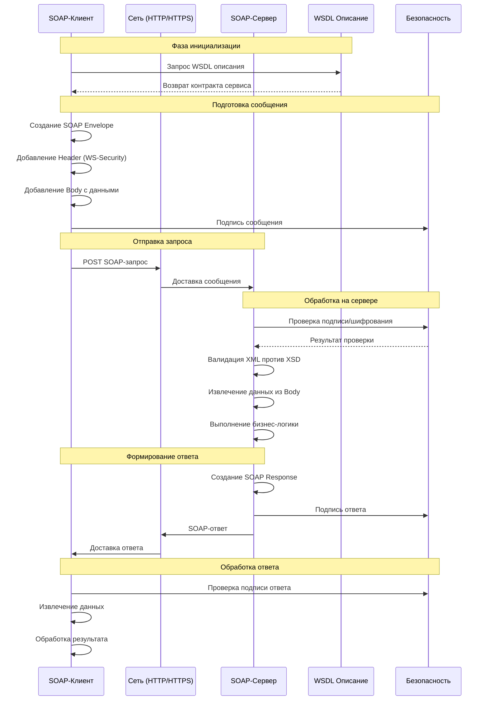
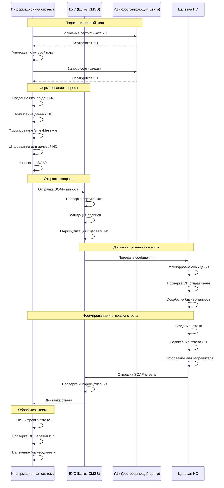

## Как работает SOAP

### Архитектура SOAP

SOAP (Simple Object Access Protocol) - это протокол для обмена структурированными сообщениями в распределенных системах. Вот как он работает:

### 1. Базовые компоненты SOAP

**Структура SOAP-конверта:**
```xml
<!-- Обязательная структура -->
<soap:Envelope>
    <soap:Header>     <!-- Опционально: метаданные -->
    <soap:Body>       <!-- Обязательно: основное содержимое -->
    <soap:Fault>      <!-- Опционально: информация об ошибках -->
</soap:Envelope>
```

### 2. Детальный процесс взаимодействия



### 3. Пример SOAP сообщения

**Запрос:**
```xml
<?xml version="1.0" encoding="UTF-8"?>
<soap:Envelope 
    xmlns:soap="http://www.w3.org/2003/05/soap-envelope"
    xmlns:exam="http://www.example.org/books">
    
    <soap:Header>
        <wsse:Security 
            xmlns:wsse="http://docs.oasis-open.org/wss/2004/01/oasis-200401-wss-wssecurity-secext-1.0.xsd">
            <wsse:UsernameToken>
                <wsse:Username>user123</wsse:Username>
                <wsse:Password Type="http://docs.oasis-open.org/wss/2004/01/oasis-200401-wss-username-token-profile-1.0#PasswordText">password456</wsse:Password>
            </wsse:UsernameToken>
        </wsse:Security>
    </soap:Header>
    
    <soap:Body>
        <exam:GetBookPriceRequest>
            <exam:BookISBN>978-5-389-08247-3</exam:BookISBN>
        </exam:GetBookPriceRequest>
    </soap:Body>
</soap:Envelope>
```

**Ответ:**
```xml
<?xml version="1.0" encoding="UTF-8"?>
<soap:Envelope 
    xmlns:soap="http://www.w3.org/2003/05/soap-envelope"
    xmlns:exam="http://www.example.org/books">
    
    <soap:Body>
        <exam:GetBookPriceResponse>
            <exam:Price>1250.00</exam:Price>
            <exam:Currency>RUB</exam:Currency>
            <exam:Timestamp>2024-01-15T14:30:00Z</exam:Timestamp>
        </exam:GetBookPriceResponse>
    </soap:Body>
</soap:Envelope>
```

## Защищенный обмен со СМЭВ

### СМЭВ (Система Межведомственного Электронного Взаимодействия)

СМЭВ - это российская государственная система для защищенного обмена данными между ведомствами.

### Диаграмма последовательностей защищенного СМЭВ-обмена



### Пример защищенного SOAP-сообщения для СМЭВ

```xml
<?xml version="1.0" encoding="UTF-8"?>
<soap:Envelope 
    xmlns:soap="http://www.w3.org/2003/05/soap-envelope"
    xmlns:wsse="http://docs.oasis-open.org/wss/2004/01/oasis-200401-wss-wssecurity-secext-1.0.xsd"
    xmlns:wsu="http://docs.oasis-open.org/wss/2004/01/oasis-200401-wss-wssecurity-utility-1.0.xsd"
    xmlns:smev="urn://x-artefacts-smev-gov-ru/services/message-exchange/types/1.1">
    
    <soap:Header>
        <wsse:Security>
            <!-- Подпись всего сообщения -->
            <ds:Signature xmlns:ds="http://www.w3.org/2000/09/xmldsig#">
                <ds:SignedInfo>
                    <ds:CanonicalizationMethod Algorithm="http://www.w3.org/2001/10/xml-exc-c14n#"/>
                    <ds:SignatureMethod Algorithm="http://www.w3.org/2001/04/xmldsig-more#gostr34102001-gostr3411"/>
                    <ds:Reference URI="#body">
                        <ds:DigestMethod Algorithm="http://www.w3.org/2001/04/xmldsig-more#gostr3411"/>
                        <ds:DigestValue>dGhpcyBpcyBzaWduZWQgZGF0YQ==</ds:DigestValue>
                    </ds:Reference>
                </ds:SignedInfo>
                <ds:SignatureValue>MIIE5jCCA06gAwIBAgIBAjANBgkq...</ds:SignatureValue>
                <ds:KeyInfo>
                    <ds:X509Data>
                        <ds:X509Certificate>MIIDXTCCAkWgAwIBAgIBAjANBgkq...</ds:X509Certificate>
                    </ds:X509Data>
                </ds:KeyInfo>
            </ds:Signature>
        </wsse:Security>
    </soap:Header>
    
    <soap:Body wsu:Id="body">
        <smev:Message>
            <smev:MessageInfo>
                <smev:MessageId>d7d18f57-4d74-4c08-b5c4-5c5c5c5c5c5c</smev:MessageId>
                <smev:Sender>
                    <smev:Code>123456789</smev:Code>
                    <smev:Name>ФНС России</smev:Name>
                </smev:Sender>
                <smev:Recipient>
                    <smev:Code>987654321</smev:Code>
                    <smev:Name>ПФР России</smev:Name>
                </smev:Recipient>
            </smev:MessageInfo>
            
            <smev:MessageData>
                <smev:AppData>
                    <!-- Зашифрованные бизнес-данные -->
                    <xenc:EncryptedData 
                        xmlns:xenc="http://www.w3.org/2001/04/xmlenc#"
                        Type="http://www.w3.org/2001/04/xmlenc#Content">
                        <xenc:EncryptionMethod Algorithm="http://www.w3.org/2001/04/xmlenc#aes256-cbc"/>
                        <ds:KeyInfo xmlns:ds="http://www.w3.org/2000/09/xmldsig#">
                            <xenc:EncryptedKey>
                                <xenc:EncryptionMethod Algorithm="http://www.w3.org/2001/04/xmlenc#rsa-1_5"/>
                                <xenc:CipherData>
                                    <xenc:CipherValue>AbCdEfGhIjKlMnOpQrStUvWxYz...</xenc:CipherValue>
                                </xenc:CipherData>
                            </xenc:EncryptedKey>
                        </ds:KeyInfo>
                        <xenc:CipherData>
                            <xenc:CipherValue>ZaBcDeFgHiJkLmNoPqRsTuVwXy...</xenc:CipherValue>
                        </xenc:CipherData>
                    </xenc:EncryptedData>
                </smev:AppData>
            </smev:MessageData>
        </smev:Message>
    </soap:Body>
</soap:Envelope>
```

### Ключевые особенности защищенного SOAP в СМЭВ:

1. **Электронная подпись (ЭП)** - используется ГОСТ 34.10-2012
2. **Шифрование** - ГОСТ 28147-89 для данных, RSA для ключей
3. **Сертификаты УЦ** - обязательное использование аккредитованных УЦ
4. **Транспортный уровень** - обязательное использование HTTPS
5. **Валидация** - проверка XSD-схем на всех этапах
6. **Идентификация** - использование кодов СМЭВ участников

Этот подход обеспечивает полное соответствие требованиям ФЗ-63 "Об электронной подписи" и обеспечивает юридическую значимость всех передаваемых документов.