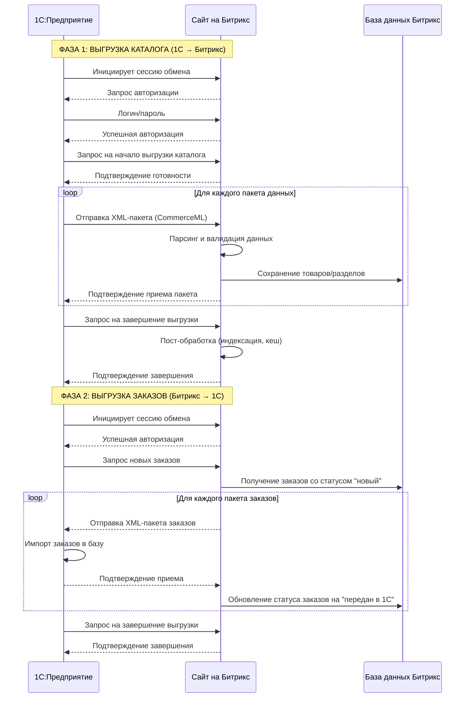

Модуль 2 — это погружение в сердце контентной модели Битрикс и основу для кастомизации системы. 

### **Модуль 2. Инфоблоки. Использование API «1С-Битрикс»**

---

### **1. Понятие инфоблока**

**Информационный блок (Инфоблок)** — это, пожалуй, самый важный и фундаментальный модуль в «1С-Битрикс». Его можно представить как **умную, структурированную таблицу в базе данных**, предназначенную для хранения однотипных данных.

**Простая аналогия:** Представьте себе обычную таблицу Excel:
*   **Лист книги** — это сам *Информационный блок* (например, "Новости").
*   **Группы строк** — это *Разделы* инфоблока (например, "Экономика", "Спорт").
*   **Отдельные строки** — это *Элементы* инфоблока (например, конкретная новость "Компания X показала рост прибыли").
*   **Столбцы** — это *Свойства* инфоблока (например, "Источник новости", "Фотография", "Тэги").

**Для чего нужны инфоблоки?**
Для хранения любого повторяющегося контента: новости, статьи, товары, каталог продукции, вакансии, сотрудники, отзывы, баннеры и т.д.

**Ключевые сущности:**
*   **Тип инфоблока:** Группа для объединения нескольких инфоблоков (например, тип "Контент" может содержать инфоблоки "Новости", "Статьи", "Блог").
*   **Инфоблок:** Непосредственно контейнер для данных.
*   **Раздел:** Категория или папка для группировки элементов. Имеет древовидную структуру (разделы могут быть вложенными).
*   **Элемент:** Конкретная единица информации (одна новость, один товар).
*   **Свойство:** Дополнительные характеристики элемента или раздела.

---

### **2. Свойства инфоблока и его разделов**

**Свойства бывают двух уровней:**

1.  **Свойства элементов:** Характеристики, относящиеся к каждому элементу.
    *   **Примеры для элемента "Товар":** `Цвет`, `Размер`, `Производитель`, `Артикул`, `Хит продаж (флажок Yes/No)`.
    *   **Типы свойств:** Строка, число, файл, список, привязка к элементам других инфоблоков (это мощный инструмент для создания связей).

2.  **Свойства разделов:** Характеристики, относящиеся ко всему разделу в целом.
    *   **Примеры для раздела "Одежда":** `SEO-описание`, `Картинка для баннера`, `Менеджер, ответственный за раздел`.

**Где это настраивается?**
В Административном разделе: `Контент` -> `Информационные блоки` -> [Выбираем нужный инфоблок] -> `Свойства`.

---

### **3. Импорт-экспорт данных инфоблока**

Это механизмы для массового добавления или выгрузки данных.

*   **Импорт:**
    *   **Интерфейс:** `Контент` -> `Информационные блоки` -> [Выбираем инфоблок] -> кнопка `Импорт`.
    *   **Формат:** CSV-файл. Вы можете массово создавать/обновлять элементы, разделы, а также их свойства.
    *   **Сценарии использования:** Первоначальное наполнение каталога, ежедневное обновление цен и остатков из 1С, пакетное добавление новостей.

*   **Экспорт:**
    *   **Интерфейс:** Аналогично, кнопка `Экспорт`.
    *   **Цель:** Получить данные из инфоблока для анализа, обработки во внешней программе или для резервной копии структуры.

---

### **4. Введение в API системы «1С-Битрикс»**

**API (Application Programming Interface)** — это набор готовых классов, методов и функций, которые предоставляет Битрикс для взаимодействия с его ядром и данными извне.

**Зачем нужно API?**
Чтобы программно (с помощью PHP-кода) выполнять действия, которые обычно делаются через админку: получать список новостей, добавлять товар в корзину, создавать пользователя, обновлять свойства элемента.

**Где находится документация?**
Официальная документация на [dev.1c-bitrix.ru](https://dev.1c-bitrix.ru/) — ваш главный источник.

**Основные пространства имен (с появлением D7):**
*   `\Bitrix\Main\*` — общие функции (запросы, файлы, система).
*   `\Bitrix\Iblock\*` — работа с инфоблоками.
*   `\Bitrix\Catalog\*` — работа с торговым каталогом.
*   `\Bitrix\Sale\*` — работа с заказами и корзиной.

---

### **5. Использование основных функций API**

Рассмотрим на примере работы с инфоблоками.

**Старый стиль (CIBlockElement) — еще очень распространен:**
```php
<?php
// Подключаем модуль "Информационные блоки"
if (!CModule::IncludeModule("iblock")) {
    return;
}

// Получаем список элементов (новостей)
$res = CIBlockElement::GetList(
    ["DATE_ACTIVE_FROM" => "DESC"], // Сортировка по дате
    ["IBLOCK_ID" => 5, "ACTIVE" => "Y"], // Фильтр по ID инфоблока и активности
    false, // Группировка
    ["nPageSize" => 10], // Постраничная навигация
    ["ID", "NAME", "DATE_ACTIVE_FROM", "PREVIEW_TEXT"] // Выбираемые поля
);
while ($element = $res->GetNext()) {
    echo $element['NAME'] . '<br>';
}
?>
```

**Новый (D7) стиль — более современный и предпочтительный:**
```php
<?php
// Не нужно явно подключать модуль, если используется автозагрузка Composer
use Bitrix\Iblock\Elements\ElementObject; // Если используется "API элементов" нового UF

// Чаще используется через ElementTable
use Bitrix\Iblock\ElementTable;

$query = ElementTable::getList([
    'select' => ['ID', 'NAME', 'DATE_ACTIVE_FROM'],
    'filter' => ['=IBLOCK_ID' => 5, '=ACTIVE' => 'Y'],
    'order' => ['DATE_ACTIVE_FROM' => 'DESC'],
    'limit' => 10
]);
while ($element = $query->fetch()) {
    echo $element['NAME'] . '<br>';
}
?>
```

---

### **6. События и работа с ними**

**События (Events)** — это механизм, который позволяет выполнять ваш собственный код в момент, когда в системе происходит определенное действие.

**Типы событий:**
1.  **События модулей (Event Manager):** Срабатывают при вызове API-методов.
    *   `OnBeforeIBlockElementAdd` / `OnAfterIBlockElementAdd` — до/после добавления элемента.
    *   `OnBeforeIBlockElementUpdate` / `OnAfterIBlockElementUpdate` — до/после обновления элемента.
    *   `OnSaleOrderSaved` — после сохранения заказа.

2.  **Агенты:** Это запланированные события, которые выполняются по расписанию (например, раз в день).

**Как это используется?**
*   **Пример:** При добавлении нового товара (`OnAfterIBlockElementAdd`) автоматически отправить уведомление менеджеру.
*   **Пример:** Перед сохранением заказа (`OnSaleOrderSaved`) проверить наличие товара на складе.
*   **Пример:** Автоматически генерировать ЧПУ для элемента при его сохранении.

**Где регистрируются обработчики?**
В файле `/local/php_interface/init.php` (предпочтительно) или в `/bitrix/php_interface/init.php`.

**Пример кода:**
```php
<?php
// В файле /local/php_interface/init.php

use Bitrix\Main\EventManager;

$eventManager = EventManager::getInstance();

// Добавляем обработчик на событие "После добавления элемента инфоблока"
$eventManager->addEventHandler(
    "iblock",
    "OnAfterIBlockElementAdd",
    function (&$arFields) {
        if ($arFields["IBLOCK_ID"] == 5) { // Если это наш инфоблок "Новости"
            // Отправляем email-уведомление
            mail('admin@site.ru', 'Добавлена новость', 'Новая новость: ' . $arFields['NAME']);
        }
    }
);
?>
```

---

### **7. Пользовательская настройка форм редактирования элементов**

Иногда стандартной формы редактирования элемента инфоблока недостаточно.

**Задача:** Добавить свое поле, изменить логику сохранения, скрыть или показать поля в зависимости от других значений.

**Способы решения:**

1.  **Пользовательские свойства (Свойства инфоблока):** Самый простой способ. Вы просто добавляете новое свойство типа "Строка", "Файл" и т.д. Оно автоматически появится в форме редактирования.

2.  **События для модификации формы:**
    *   Событие `OnBuildIBlockElementForm` позволяет программно добавить свои HTML-поля в форму. (Устаревший, но рабочий способ).

3.  **Пользовательские поля (User Fields) для высоконагруженных проектов (D7):**
    *   В новых версиях для элементов, основанных на D7 (`Битрикс > API-интерфейсы > Конструктор API`), можно добавлять свои поля как пользовательские (UF). Это самый современный и правильный способ, интегрирующийся напрямую в ORM Битрикс.

**Примерная логика:**
Вы создаете кастомное поле "Дополнительный заголовок". С помощью событий `OnBeforeIBlockElementAdd` и `OnBeforeIBlockElementUpdate` вы можете валидировать его или обрабатывать его значение перед сохранением в базу.

Этот модуль превращает вас из простого пользователя админки в разработчика, способного гибко настраивать систему под любые бизнес-требования. Вы учитесь не только *хранить* данные в инфоблоках, но и *программно управлять* ими.

Интеграция «1С-Битрикс» с «1С:Предприятие» — это одна из ключевых фишек платформы, которая позволяет создать по-настоящему мощный и автоматизированный интернет-магазин.

Давайте разберем это по шагам и компонентам.

### **Суть интеграции**

Главная цель — **синхронизировать данные между вашей учетной системой (1С) и сайтом на Битриксе** в автоматическом или полуавтоматическом режиме.

**Что именно синхронизируется?**
*   **Товары:** Номенклатура, характеристики, описания, фотографии.
*   **Остатки:** Количество товара на складах.
*   **Цены:** Прайс-листы (розничные, оптовые, специальные).
*   **Заказы:** Заказы, созданные на сайте, передаются в 1С для обработки (сборки, отгрузки, учета).
*   **Контрагенты (Клиенты):** Данные о покупателях могут передаваться из сайта в 1С.

---

### **Основные способы интеграции**

Есть два основных подхода, которые часто используются вместе.

#### **1. Стандартный обмен через "1С-Битрикс: Обмен данными"**

Это самый распространенный и рекомендуемый способ для типовых задач. Он использует механизм **обмена по протоколу CommerceML**.

**CommerceML (Commerce Markup Language)** — это специальный формат XML, разработанный именно для обмена коммерческими данными между учетными системами и интернет-магазинами.

**Как это работает (схема "Выгрузка из 1С в Битрикс"):**


1.  **В 1С:** Запускается обработка (например, "Выгрузка данных на сайт Битрикс"). Она является **инициатором обмена**.
2.  **1С формирует пакет данных:** Система 1С упаковывает все новые и измененные товары, остатки, цены в XML-файлы по стандарту CommerceML.
3.  **1С отправляет запрос на сайт:** Через HTTP-запрос 1С "стучится" на специальный URL сайта Битрикс (`/bitrix/admin/1c_exchange.php`).
4.  **Битрикс проверяет авторизацию:** Сайт запрашивает логин и пароль (которые настраиваются в админке Битрикс).
5.  **Начинается диалог (Handshake):**
    *   1С: "Привет, я готова выгрузить каталог".
    *   Битрикс: "ОК, присылай".
    *   1С: "Вот пакет данных, часть 1 из 5".
    *   Битрикс: "Принял, давай следующую".
    *   ... и так далее, пока все данные не будут переданы.
6.  **Битрикс обрабатывает данные:** Полученные XML-файлы обрабатываются модулем обмена. На сайте создаются или обновляются:
    *   **Товары** (как элементы инфоблоков).
    *   **Разделы каталога.**
    *   **Остатки и цены** (хранятся в модуле "Торговый каталог").
    *   **Характеристики товаров** (как свойства элементов).

**Как это работает (схема "Загрузка заказов из Битрикс в 1С"):**

1.  **В 1С:** Запускается обработка "Загрузка заказов с сайта".
2.  **1С запрашивает новые заказы.**
3.  **Битрикс формирует пакет:** Сайт упаковывает все новые заказы (с составом, данными покупателя и т.д.) в XML по стандарту CommerceML.
4.  **1С забирает и обрабатывает заказы:** Данные импортируются в 1С, где на их основе могут создаваться:
    *   Реализации.
    *   Заказы покупателей.
    *   Резервации.

**Ключевые настройки в админке Битрикс:**
`Магазин` -> `Настройки` -> `Настройки модуля "Интернет-магазин"` -> вкладка `1С` -> `Профили обмена с 1С`.

Здесь настраиваются:
*   **Профили обмена** (например, "Обмен каталогом", "Обмен заказами").
*   **Пароль** для авторизации.
*   **Соответствие типов цен** в 1С и на сайте.
*   **Соответствие складов** в 1С и на сайте.
*   **Правила обработки** (например, деактивировать товары, которых нет в выгрузке).

---

#### **2. Интеграция через REST API (более гибкий способ)**

Этот способ используется, когда стандартного обмена недостаточно или нужна более тонкая и быстрая синхронизация.

**Как это работает:**

1.  **Внешняя система (1С) выступает в роли REST-клиента.**
2.  **В 1С** пишется код на встроенном языке, который умеет отправлять HTTP-запросы (например, через объект `HTTPСоединение`).
3.  **1С обращается к REST API Битрикса** по специальному URL.
4.  **Битрикс имеет мощный REST API** для работы с сущностями:
    *   `crm.product.list` — получить список товаров.
    *   `crm.product.add` — добавить товар.
    *   `sale.basket.add` — добавить товар в корзину пользователя.
    *   `crm.deal.list` — получить список сделок (заказов).

**Пример сценария:** При изменении остатка по конкретному товару в 1С, система сразу отправляет REST-запрос на сайт: `sale.product.update` с новым значением остатка. Сайт обновляет его почти мгновенно, без ожидания полного выгрузки всего каталога.

**Плюсы REST API:**
*   **Гибкость:** Можно синхронизировать что угодно и как угодно.
*   **Скорость:** Мгновенное обновление отдельных позиций.
*   **Возможность двусторонней синхронизации:** Легко как получать данные из Битрикс, так и отправлять их в него.

**Минусы:**
*   **Требует глубоких знаний** как 1С, так и API Битрикс.
*   Нужно писать больше кода.

---

### **Типовой сценарий работы автоматизированного магазина**

1.  **Раз в час (ночью)** запускается автоматическая выгрузка из 1С в Битрикс по расписанию через стандартный обмен. Обновляются все товары, цены, остатки.
2.  **В течение дня** при резком изменении остатков (например, товар закончился) 1С отправляет REST-запрос для мгновенного обновления на сайте.
3.  **Покупатель** оформляет заказ на сайте.
4.  **Каждые 15 минут** 1С автоматически опрашивает сайт через стандартный обмен и забирает новые заказы.
5.  **Менеджер** видит заказ уже в 1С, формирует отгрузку, меняет статус.
6.  **Новый статус заказа** из 1С может передаться обратно на сайт (через тот же обмен или REST), и покупатель видит в личном кабинете: "Ваш заказ собран и передан в службу доставки".

### **Итог**

**Интеграция "1С-Битрикс" — это не магия, а хорошо отлаженный механизм, основанный на:**

1.  **Стандартном обмене CommerceML** для регулярной массовой синхронизации каталога и заказов. Это "рабочая лошадка".
2.  **REST API** для точечных, мгновенных обновлений и нестандартных задач. Это "тонкий инструмент".

Рассмотрим диаграмму последовательностей, которая наглядно показывает процесс обмена данными между 1С и Битрикс через стандартный протокол CommerceML.



### **Пояснения к диаграмме:**

1. **Инициализация и авторизация:**
   - 1С всегда выступает **инициатором** обмена
   - Битрикс проверяет подлинность через логин/пароль

2. **Протокол рукопожатия (Handshake):**
   - Перед каждой фазой идет "договоренность" о типах данных
   - Подтверждения на каждом этапе гарантируют целостность передачи

3. **Пакетная передача:**
   - Данные передаются частями (пакетами), а не одним файлом
   - Это предотвращает таймауты при большом объеме данных

4. **Двусторонний обмен:**
   - **Фаза 1:** 1С → Битрикс (товары, цены, остатки)
   - **Фаза 2:** Битрикс → 1С (заказы, клиенты)

5. **Статусная модель:**
   - После успешной передачи заказов Битрикс меняет их статус
   - Это предотвращает повторную отправку одних и тех же заказов

### **Что происходит с данными на стороне Битрикс:**

- **Товары** → сохраняются как элементы инфоблоков
- **Цены** → сохраняются в модуле "Торговый каталог"
- **Остатки** → обновляются в складском учете
- **Заказы** → создаются как заказы интернет-магазина

Такой последовательный подход обеспечивает надежную и предсказуемую синхронизацию даже при больших объемах данных.


## **Типовой сценарий: ежедневное обновление каталога и выгрузка заказов**

**Контекст:** 
- Интернет-магазин "ЭлектроникМаркет"
- В 1С ведется полный складской учет
- На сайте 5000+ товарных позиций
- 50-100 заказов daily

---

### **ЭТАП 1: Подготовка к обмену (21:00)**

**В 1С:**
1. **Запуск обработки:** Менеджер заходит в раздел "Интернет-магазин" → "Обмен данными с сайтом"
2. **Настройка параметров:**
   - Выбирает профиль: "Ежедневное обновление"
   - Указывает дату последнего обмена: [автоматически]
   - Ставит галочки:
     - ✅ Выгружать товары и цены
     - ✅ Выгружать остатки
     - ✅ Загружать заказы

**В Битрикс:**
```php
// Автоматически в это время выполняются подготовительные действия
// Очистка временных файлов предыдущего обмена
// Проверка доступности папок для загрузки изображений
// Логирование начала сессии
```

---

### **ЭТАП 2: Выгрузка товаров и остатков (21:00-21:20)**

**Шаг 2.1 - Начало сессии**
```
1С → Битрикс: POST /bitrix/admin/1c_exchange.php?type=catalog&mode=checkauth
Битрикс → 1С: success\nsession_id\n12345
```

**Шаг 2.2 - Инициализация выгрузки**
```
1С → Битрикс: type=catalog&mode=init
Битрикс → 1С: zip=yes\nfile_limit=50000000
// "Мы готовы, принимаем файлы до 50МБ, поддерживаем сжатие"
```

**Шаг 2.3 - Выгрузка классификатора (группы товаров)**
```xml
<!-- 1С формирует и отправляет -->
<catalog>
    <classifier>
        <groups>
            <group id="cat1">
                <name>Ноутбуки и компьютеры</name>
            </group>
            <group id="cat2">
                <name>Смартфоны и гаджеты</name>
                <group id="cat2-1">
                    <name>Смартфоны</name>
                </group>
            </group>
        </groups>
    </classifier>
</catalog>
```

**Шаг 2.4 - Выгрузка товаров пакетами**

*Пакет 1 (ноутбуки):*
```xml
<catalog>
    <products>
        <product id="n12345">
            <name>Ноутбук ASUS VivoBook 15</name>
            <categoryId>cat1</categoryId>
            <vendor>ASUS</vendor>
            <properties>
                <property name="Диагональ">15.6"</property>
                <property name="Процессор">Intel Core i5</property>
            </properties>
            <prices>
                <price type="retail">54990</price>
                <price type="wholesale">51990</price>
            </prices>
            <stock>
                <warehouse name="main">15</warehouse>
                <warehouse name="reserve">3</warehouse>
            </stock>
            <images>
                <image url="https://1c-server/images/n12345_1.jpg"/>
            </images>
        </product>
    </products>
</catalog>
```

*В это время в Битрикс происходит:*
```php
// Для каждого товара в XML:
if ($element = CIBlockElement::GetList(...)) {
    // Товар существует - ОБНОВЛЯЕМ
    CIBlockElement::SetPropertyValuesEx($elementId, $IBLOCK_ID, $properties);
    CPrice::SetBasePrice($productId, $newPrice, "RUB");
    CCatalogProduct::Update($productId, ["QUANTITY" => $newQuantity]);
} else {
    // Товар не существует - СОЗДАЕМ
    $el = new CIBlockElement;
    $el->Add([
        "NAME" => "Ноутбук ASUS VivoBook 15",
        "IBLOCK_ID" => CATALOG_IBLOCK_ID,
        "CODE" => "n12345"
    ]);
}
```

**Шаг 2.5 - Деактивация отсутствующих товаров**
```xml
<!-- 1С отправляет список ВСЕХ товаров, которые должны быть активны -->
<products>
    <product id="n12345"/>
    <product id="s67890"/>
    <!-- ... -->
</products>
```

```php
// Битрикс находит товары, которых нет в выгрузке
$dbRes = CIBlockElement::GetList(...);
while ($arRes = $dbRes->Fetch()) {
    if (!in_array($arRes['ID'], $currentProducts)) {
        // Деактивируем товар, которого нет в 1С
        CIBlockElement::SetPropertyValuesEx(
            $arRes['ID'], 
            CATALOG_IBLOCK_ID, 
            ["ACTIVE" => "N"]
        );
    }
}
```

---

### **ЭТАП 3: Выгрузка заказов с сайта (21:20-21:25)**

**Шаг 3.1 - Инициализация сессии заказов**
```
1С → Битрикс: type=sale&mode=checkauth
Битрикс → 1С: success\nsession_id\n67890
```

**Шаг 3.2 - Запрос заказов**
```
1С → Битрикс: type=sale&mode=query
```

**Шаг 3.3 - Битрикс формирует ответ с новыми заказами**
```xml
<коммерческаяИнформация>
    <документ>
        <иД>ORDER_78451</иД>
        <номер>78451</номер>
        <дата>2024-01-15</дата>
        <время>14:30:25</время>
        <контрагент>
            <имя>Иванов Петр Сергеевич</имя>
            <телефон>+79161234567</телефон>
            <email>client@mail.ru</email>
        </контрагент>
        <стоимостьДоставки>500</стоимостьДоставки>
        <товары>
            <товар>
                <иД>n12345</иД>
                <наименование>Ноутбук ASUS VivoBook 15</наименование>
                <цена>54990</цена>
                <количество>1</количество>
                <сумма>54990</сумма>
            </товар>
        </товары>
        <значенияРеквизитов>
            <реквизит>
                <наименование>СтатусОплаты</наименование>
                <значение>Оплачен</значение>
            </реквизит>
        </значенияРеквизитов>
    </документ>
</коммерческаяИнформация>
```

**Шаг 3.4 - 1С подтверждает получение**
```
1С → Битрикс: type=sale&mode=success
```

---

### **ЭТАП 4: Обработка в 1С (21:25-21:30)**

**В 1С автоматически создаются:**
1. **Документ "Заказ покупателя"** с номером 78451
2. **Контрагент** (или находится существующий)
3. **Резервация товаров** на складе
4. **Проведение документов**

```1c
// Пример кода в обработке 1С
Для Каждого УзелЗаказа Из Заказы Цикл
    ДокЗаказ = Документы.ЗаказыПокупателей.СоздатьДокумент();
    ДокЗаказ.Дата = УзелЗаказа.Дата;
    ДокЗаказ.Контрагент = НайтиИлиСоздатьКонтрагента(УзелЗаказа.Контрагент);
    
    Для Каждого Товар Из УзелЗаказа.Товары Цикл
        Строка = ДокЗаказ.Товары.Добавить();
        Строка.Номенклатура = Справочники.Номенклатура.НайтиПоКоду(Товар.иД);
        Строка.Количество = Товар.Количество;
        Строка.Цена = Товар.Цена;
    КонецЦикла;
    
    ДокЗаказ.Записать();
    ДокЗаказ.Провести();
КонецЦикла;
```

---

### **ЭТАП 5: Завершение обмена (21:30)**

**Шаг 5.1 - Финализация**
```
1С → Битрикс: type=catalog&mode=complete
Битрикс → 1С: success
```

**Шаг 5.2 - Логирование результатов**

*В Битрикс:*
```php
// Запись в лог
CEventLog::Add([
    "SEVERITY" => "INFO",
    "AUDIT_TYPE_ID" => "1C_EXCHANGE",
    "MODULE_ID" => "sale",
    "DESCRIPTION" => "Обмен завершен. "
        ."Обновлено товаров: 124. "
        ."Выгружено заказов: 15. "
        ."Время выполнения: 28 минут."
]);
```

*В 1С:*
- Формируется отчет о результате обмена
- Отправляется email-уведомление менеджеру

---

### **ЭТАП 6: Пост-обработка в Битрикс (21:30-21:35)**

1. **Переиндексация поиска** - обновление поискового индекса
2. **Очистка кеша** - сброс кешированных данных товаров
3. **Обновление sitemap.xml** - актуализация карты сайта
4. **Отправка уведомлений** менеджерам о завершении обмена

---

### **Результат к утру следующего дня:**

✅ **На сайте:** Актуальные цены, точные остатки, новые товары  
✅ **В 1С:** Все заказы обработаны, резервы созданы  
✅ **У менеджеров:** Готовые к отгрузке заказы  
✅ **У клиентов:** Корректная информация о наличии товаров  

Такой сценарий обеспечивает полную синхронизацию бизнес-процессов между онлайн-магазином и системой учета.

**"Использование основных функций API"** с практическими примерами и объяснениями.

## **Основы работы с API в Битрикс**

### **1. Два подхода к работе с API**

#### **Подход 1: Старый стиль (CIBlockElement, CIBlockSection)**

Этот подход используется в legacy-коде и простых задачах.

```php
<?
// 1. ПОДКЛЮЧЕНИЕ МОДУЛЯ
if (!CModule::IncludeModule("iblock")) {
    throw new Exception("Модуль iblock не установлен");
}

// 2. ПОЛУЧЕНИЕ СПИСКА ЭЛЕМЕНТОВ
$res = CIBlockElement::GetList(
    ["SORT" => "ASC", "ID" => "DESC"],    // Сортировка
    [                                    // Фильтр
        "IBLOCK_ID" => 2,
        "ACTIVE" => "Y",
        "SECTION_ID" => 10
    ],
    false,                              // Группировка
    ["nPageSize" => 20, "iNumPage" => 1], // Постраничка
    ["ID", "NAME", "DATE_ACTIVE_FROM", "PROPERTY_*"] // Выборка полей
);

// 3. ОБРАБОТКА РЕЗУЛЬТАТА
while ($element = $res->GetNext()) {
    echo "ID: " . $element['ID'] . "<br>";
    echo "Название: " . $element['NAME'] . "<br>";
    echo "Дата: " . $element['DATE_ACTIVE_FROM'] . "<br>";
    
    // Работа со свойствами
    if ($element['PROPERTY_COLOR_VALUE']) {
        echo "Цвет: " . $element['PROPERTY_COLOR_VALUE'] . "<br>";
    }
}
?>
```

#### **Подход 2: Новый стиль (D7 - DataBase 7)**

Современный объектно-ориентированный подход.

```php
<?
// 1. ИСПОЛЬЗОВАНИЕ ПРОСТРАНСТВ ИМЕН
use Bitrix\Iblock\Elements\ElementTable;
use Bitrix\Iblock\SectionTable;
use Bitrix\Main\Loader;
use Bitrix\Main\Type\DateTime;

// 2. ПОДКЛЮЧЕНИЕ МОДУЛЯ
if (!Loader::includeModule('iblock')) {
    return;
}

// 3. ПОЛУЧЕНИЕ ДАННЫХ ЧЕРЕЗ ORM
$query = ElementTable::getList([
    'select' => [
        'ID',
        'NAME', 
        'DATE_ACTIVE_FROM',
        'COLOR_VALUE' => 'COLOR.VALUE', // Свойство типа "список"
        'PRICE_VALUE' => 'PRICE.VALUE', // Свойство типа "число"
    ],
    'filter' => [
        '=IBLOCK_ID' => 2,
        '=ACTIVE' => true,
        '>=DATE_ACTIVE_FROM' => new DateTime('2024-01-01', 'Y-m-d'),
    ],
    'order' => ['SORT' => 'ASC', 'ID' => 'DESC'],
    'limit' => 20,
    'offset' => 0
]);

// 4. ОБРАБОТКА РЕЗУЛЬТАТА
while ($element = $query->fetch()) {
    echo "ID: " . $element['ID'] . "<br>";
    echo "Название: " . $element['NAME'] . "<br>";
    echo "Цвет: " . $element['COLOR_VALUE'] . "<br>";
    echo "Цена: " . $element['PRICE_VALUE'] . "<br>";
}
?>
```

---

## **2. Основные операции CRUD с элементами**

### **Добавление элемента**

```php
<?
// СТАРЫЙ СТИЛЬ
$el = new CIBlockElement;

$elementId = $el->Add([
    "IBLOCK_ID" => 2,
    "NAME" => "Новый товар",
    "CODE" => "new-product-123", // символьный код
    "PREVIEW_TEXT" => "Краткое описание",
    "DETAIL_TEXT" => "Детальное описание",
    "ACTIVE" => "Y",
    "SORT" => 500,
    "DATE_ACTIVE_FROM" => ConvertTimeStamp(time(), "FULL"),
    "PROPERTY_VALUES" => [
        "COLOR" => "red",           // простое свойство
        "SIZE" => [10, 15, 20],     // множественное свойство
        "PRICE" => 1500,
        "MANUFACTURER" => 25,       // привязка к элементу
    ]
]);

if ($elementId) {
    echo "Элемент создан с ID: " . $elementId;
} else {
    echo "Ошибка: " . $el->LAST_ERROR;
}
?>
```

```php
<?
// НОВЫЙ СТИЛЬ (D7)
use Bitrix\Iblock\ElementTable;

$result = ElementTable::add([
    'fields' => [
        'IBLOCK_ID' => 2,
        'NAME' => 'Новый товар',
        'CODE' => 'new-product-123',
        'ACTIVE' => 'Y',
    ],
    'runtime' => [
        // дополнительные runtime поля при необходимости
    ]
]);

if ($result->isSuccess()) {
    $elementId = $result->getId();
    echo "Элемент создан с ID: " . $elementId;
    
    // Добавление свойств отдельно
    \Bitrix\Iblock\ElementPropertyTable::setPropertyValues(
        $elementId,
        2,
        ['COLOR' => 'red', 'PRICE' => 1500]
    );
} else {
    $errors = $result->getErrorMessages();
    echo "Ошибки: " . implode(', ', $errors);
}
?>
```

### **Обновление элемента**

```php
<?
// СТАРЫЙ СТИЛЬ
$el = new CIBlockElement;

$success = $el->Update($elementId, [
    "NAME" => "Обновленное название",
    "PREVIEW_TEXT" => "Новое описание",
    "PROPERTY_VALUES" => [
        "PRICE" => 1800, // обновляем цену
        "HIT" => "Y",    // помечаем как хит
    ]
]);

if ($success) {
    echo "Элемент обновлен";
} else {
    echo "Ошибка: " . $el->LAST_ERROR;
}
?>
```

```php
<?
// НОВЫЙ СТИЛЬ (D7)
$result = ElementTable::update($elementId, [
    'fields' => [
        'NAME' => 'Обновленное название',
        'ACTIVE' => 'N', // деактивируем элемент
    ]
]);

if ($result->isSuccess()) {
    echo "Элемент обновлен";
} else {
    $errors = $result->getErrorMessages();
    echo "Ошибки: " . implode(', ', $errors);
}
?>
```

### **Удаление элемента**

```php
<?
// СТАРЫЙ СТИЛЬ
if (CIBlockElement::Delete($elementId)) {
    echo "Элемент удален";
} else {
    echo "Ошибка при удалении";
}

// НОВЫЙ СТИЛЬ (D7)
$result = ElementTable::delete($elementId);
if ($result->isSuccess()) {
    echo "Элемент удален";
} else {
    echo "Ошибка при удалении";
}
?>
```

---

## **3. Работа с разделами**

```php
<?
// ДОБАВЛЕНИЕ РАЗДЕЛА
$section = new CIBlockSection;

$sectionId = $section->Add([
    "IBLOCK_ID" => 2,
    "NAME" => "Новый раздел",
    "CODE" => "new-section",
    "DESCRIPTION" => "Описание раздела",
    "SORT" => 100,
    "PICTURE" => $_FILES['section_image'], // загрузка картинки
    "UF_POPULAR" => true, // пользовательское поле
]);

// ПОЛУЧЕНИЕ РАЗДЕЛОВ С ИЕРАРХИЕЙ
$res = CIBlockSection::GetList(
    ["LEFT_MARGIN" => "ASC"],
    ["IBLOCK_ID" => 2, "ACTIVE" => "Y"],
    true, // считать количество элементов
    ["ID", "NAME", "DEPTH_LEVEL", "ELEMENT_CNT"]
);

while ($section = $res->GetNext()) {
    $padding = str_repeat("--", $section['DEPTH_LEVEL'] - 1);
    echo $padding . $section['NAME'] . " (" . $section['ELEMENT_CNT'] . ")<br>";
}
// Результат:
// --Каталог (150)
// ----Электроника (80)
// ------Смартфоны (45)
?>
```

---

## **4. Сложные выборки и фильтры**

### **Работа со свойствами в фильтрах**

```php
<?
// ФИЛЬТРАЦИЯ ПО СВОЙСТВАМ
$filter = [
    "IBLOCK_ID" => 2,
    "ACTIVE" => "Y",
    "!PROPERTY_HIT" => false, // свойство HIT заполнено
    ">=PROPERTY_PRICE" => 1000,
    "<=PROPERTY_PRICE" => 5000,
    "PROPERTY_COLOR" => ["red", "blue"], // одно из значений
    "SECTION_ID" => 10, // только в разделе
    "INCLUDE_SUBSECTIONS" => true, // включая подразделы
];

// ПОИСК ПО НАЗВАНИЮ И ОПИСАНИЮ
$searchFilter = [
    "IBLOCK_ID" => 2,
    "ACTIVE" => "Y", 
    "?NAME" => "ноутбук", // поиск в названии
    "?DETAIL_TEXT" => "игровой", // поиск в описании
];

$res = CIBlockElement::GetList([], $filter, false, false, [
    "ID", 
    "NAME", 
    "PROPERTY_PRICE",
    "PROPERTY_COLOR",
    "PROPERTY_MANUFACTURER.NAME" // название привязанного элемента
]);
?>
```

### **Агрегатные функции и группировка**

```php
<?
// ГРУППИРОВКА ПО РАЗДЕЛАМ С СУММИРОВАНИЕМ
$res = CIBlockElement::GetList(
    [],
    ["IBLOCK_ID" => 2, "ACTIVE" => "Y"],
    ["IBLOCK_SECTION_ID"], // группировка по разделу
    false,
    [
        "ID",
        "IBLOCK_SECTION_ID",
        "CNT" => "ID", // количество элементов
        "MIN_PRICE" => "PROPERTY_PRICE", // минимальная цена
        "MAX_PRICE" => "PROPERTY_PRICE", // максимальная цена
    ]
);

while ($group = $res->Fetch()) {
    echo "Раздел ID: " . $group['IBLOCK_SECTION_ID'] . "<br>";
    echo "Количество: " . $group['CNT'] . "<br>";
    echo "Цены от " . $group['MIN_PRICE'] . " до " . $group['MAX_PRICE'] . "<br><br>";
}
?>
```

---

## **5. Практические примеры использования**

### **Пример 1: Создание товара с картинкой**

```php
<?
function createProductWithImage($productData, $imagePath) {
    if (!CModule::IncludeModule("iblock")) return false;
    
    // Загрузка картинки
    $fileArray = [
        "name" => basename($imagePath),
        "type" => mime_content_type($imagePath),
        "tmp_name" => $imagePath,
        "error" => 0,
        "size" => filesize($imagePath)
    ];
    
    $el = new CIBlockElement;
    $productId = $el->Add([
        "IBLOCK_ID" => PRODUCTS_IBLOCK,
        "NAME" => $productData['name'],
        "CODE" => $productData['code'],
        "PREVIEW_TEXT" => $productData['preview'],
        "DETAIL_TEXT" => $productData['detail'],
        "PREVIEW_PICTURE" => $fileArray,
        "DETAIL_PICTURE" => $fileArray,
        "ACTIVE" => "Y",
        "PROPERTY_VALUES" => [
            "PRICE" => $productData['price'],
            "ARTICLE" => $productData['article'],
            "CATEGORY" => $productData['category_id'],
        ]
    ]);
    
    return $productId;
}

// Использование
$newProductId = createProductWithImage(
    [
        'name' => 'iPhone 15 Pro',
        'code' => 'iphone-15-pro-256',
        'preview' => 'Новый флагман Apple',
        'detail' => 'Подробное описание...',
        'price' => 99990,
        'article' => 'APL-IP15P-256',
        'category_id' => 25
    ],
    '/upload/temp/iphone15.jpg'
);
?>
```

### **Пример 2: Массовое обновление цен**

```php
<?
function updatePricesBatch($priceUpdates) {
    if (!CModule::IncludeModule("iblock") || 
        !CModule::IncludeModule("catalog")) {
        return false;
    }
    
    $successCount = 0;
    $errorCount = 0;
    
    foreach ($priceUpdates as $productCode => $newPrice) {
        // Находим элемент по коду
        $res = CIBlockElement::GetList(
            [],
            ["IBLOCK_ID" => PRODUCTS_IBLOCK, "CODE" => $productCode],
            false,
            false,
            ["ID", "NAME"]
        );
        
        if ($element = $res->Fetch()) {
            // Обновляем цену в торговом каталоге
            if (CPrice::SetBasePrice($element['ID'], $newPrice, "RUB")) {
                $successCount++;
                
                // Логируем изменение
                CEventLog::Add([
                    "SEVERITY" => "INFO",
                    "AUDIT_TYPE_ID" => "PRICE_UPDATE",
                    "MODULE_ID" => "catalog",
                    "DESCRIPTION" => "Цена товара " . $element['NAME'] . 
                                   " изменена на " . $newPrice . " руб.",
                ]);
            } else {
                $errorCount++;
            }
        } else {
            $errorCount++;
        }
    }
    
    return [
        'success' => $successCount,
        'errors' => $errorCount
    ];
}

// Использование
$result = updatePricesBatch([
    'iphone-15-pro-256' => 94990,
    'samsung-s23-128' => 69990,
    'xiaomi-13-256' => 45990
]);

echo "Обновлено: " . $result['success'] . ", ошибок: " . $result['errors'];
?>
```

### **Пример 3: Получение товаров с пагинацией**

```php
<?
function getProductsPaginated($page = 1, $pageSize = 20, $filter = []) {
    if (!CModule::IncludeModule("iblock")) return [];
    
    $defaultFilter = [
        "IBLOCK_ID" => PRODUCTS_IBLOCK,
        "ACTIVE" => "Y",
        "!PROPERTY_PRICE" => false
    ];
    
    $finalFilter = array_merge($defaultFilter, $filter);
    
    // Получаем элементы
    $res = CIBlockElement::GetList(
        ["SORT" => "ASC", "ID" => "DESC"],
        $finalFilter,
        false,
        ["nPageSize" => $pageSize, "iNumPage" => $page],
        ["ID", "NAME", "CODE", "PREVIEW_PICTURE", "PROPERTY_PRICE"]
    );
    
    $products = [];
    while ($product = $res->GetNext()) {
        // Получаем картинку в нужном формате
        if ($product['PREVIEW_PICTURE']) {
            $product['PREVIEW_PICTURE_SRC'] = CFile::GetPath($product['PREVIEW_PICTURE']);
        }
        
        $products[] = $product;
    }
    
    // Получаем общее количество для пагинации
    $totalCount = CIBlockElement::GetList([], $finalFilter, []);
    
    return [
        'products' => $products,
        'totalCount' => $totalCount,
        'currentPage' => $page,
        'pageSize' => $pageSize,
        'totalPages' => ceil($totalCount / $pageSize)
    ];
}

// Использование
$pageData = getProductsPaginated(1, 12, [
    "SECTION_ID" => 10,
    ">=PROPERTY_PRICE" => 5000
]);

foreach ($pageData['products'] as $product) {
    echo "<div class='product'>";
    echo "";
    echo "<h3>" . $product['NAME'] . "</h3>";
    echo "<p>Цена: " . $product['PROPERTY_PRICE_VALUE'] . " руб.</p>";
    echo "</div>";
}

// Пагинация
echo "Страница " . $pageData['currentPage'] . " из " . $pageData['totalPages'];
?>
```

---

## **6. Лучшие практики и рекомендации**

### **Оптимизация производительности:**
```php
<?
// ПЛОХО: Получение всех полей
$res = CIBlockElement::GetList([], $filter);

// ХОРОШО: Явное указание нужных полей
$res = CIBlockElement::GetList([], $filter, false, false, [
    "ID", "NAME", "CODE", "PROPERTY_PRICE"
]);

// ОЧЕНЬ ХОРОШО: Кеширование частых запросов
$cache = Bitrix\Main\Data\Cache::createInstance();
$cacheTime = 3600;
$cacheId = "products_list_" . md5(serialize($filter));

if ($cache->initCache($cacheTime, $cacheId, "/products/")) {
    $products = $cache->getVars();
} else {
    $cache->startDataCache();
    $products = getProductsFromDB($filter);
    $cache->endDataCache($products);
}
?>
```

### **Обработка ошибок:**
```php
<?
try {
    $result = ElementTable::add($fields);
    
    if (!$result->isSuccess()) {
        $errors = $result->getErrorMessages();
        throw new Exception("Ошибки добавления: " . implode(", ", $errors));
    }
    
    // Успешное выполнение
    $newId = $result->getId();
    
} catch (Exception $e) {
    // Логирование ошибки
    CEventLog::Add([
        "SEVERITY" => "ERROR",
        "AUDIT_TYPE_ID" => "API_ERROR",
        "MODULE_ID" => "iblock", 
        "DESCRIPTION" => $e->getMessage(),
    ]);
    
    // Пользовательское сообщение
    ShowError("Произошла ошибка: " . $e->getMessage());
}
?>
```

Этот подробный разбор показывает, что API Битрикс предоставляет мощные инструменты для работы с данными, от простых операций до сложных бизнес-процессов. Ключевой момент — выбор правильного подхода (старый vs новый стиль) в зависимости от конкретной задачи и требований проекта.